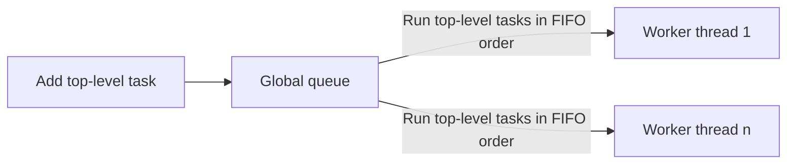
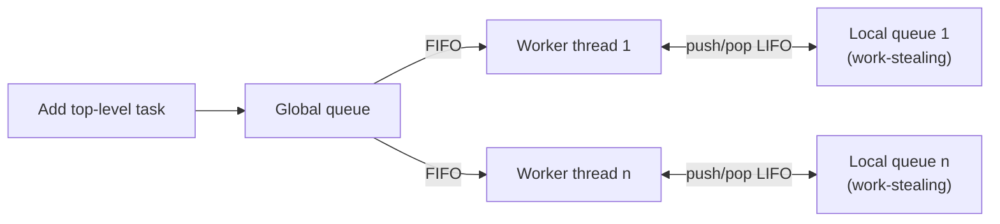

# Uge 11.1 — Concurrency: Parallel Tasks i C#/.NET

## Metadata

| Felt | Værdi |
|---|---|
| **Lektion** | Uge 11.1 — Concurrency, parallel tasks |
| **Kursus** | Softwaredesign (SW4SWD-01) |
| **Forelæser** | Jørn Martin Hajek (HAJ) |
| **Kilde** | `Concurrency - Parallel Tasks.pptx` konverteret til PDF (18 slides) |
| **Sprog/kode** | C# |
| **Emner dækket** | Task Parallel Library (TPL), `Task.Run`, `Parallel.Invoke`, `Task.Factory.StartNew`, `Wait`/`WaitAll`/`WaitAny`, default task scheduler, work-stealing queues, task inlining, closures, state objects, Task-based Asynchronous Pattern (TAP), `async`/`await`, `ConfigureAwait` |

> Bemærk: decket er konverteret fra PowerPoint via LibreOffice. Indholdet er korrekt; den præcise placering af tekstbokse på sliden kan afvige fra originalen.

---

## Agenda

1. Task Basics
2. The Default Task Scheduler
3. Passing data to asynchronous work
4. The Task-Based Asynchronous Pattern (TAP)

> Slide 2

---

## 1. Task Basics

En task er "an isolated, logical unit of work — a sequential operation fit for parallelization". Tre præciseringer fra sliden:

- A task is **NOT** a thread.
- A task is a **sequential** operation.
- Den bor i namespacet `System.Threading.Tasks`.

Brug parallel tasks når du har flere distinkte asynchronous operations (uddybes under TAP).

Tasks leveres af **Task Parallel Library (TPL)**:

- Del af Microsoft Parallel Extensions for .NET (sammen med PLINQ).
- "TPL dynamically scales the degree of parallelism to most efficiently use all processors available."
- TPL hjælper med partitionering af arbejde og scheduling af tasks i .NET thread pool'en.

> Slide 3

Pointen er abstraktionsniveauet: en tråd er en OS-ressource, der koster ~1 MB stak og hundredtusindvis af cyklusser at oprette. En task er blot et work item, der placeres i en kø. Derfor kan man have millioner af tasks på få tråde, mens millioner af tråde er umuligt.

---

## 2. Starting tasks

Task parallelism at its simplest — fire varianter af samme arbejde, `DoLeft()` og `DoRight()`:

```csharp
// Good ole sequential code
public void DoAll()
{
  DoLeft();
  DoRight();
}
```

```csharp
// Using Parallel.Invoke()
public void DoAll()
{
  // Parallel.Invoke() automatically creates tasks
  // for the arguments, then awaits for completion
  Parallel.Invoke(DoLeft, DoRight);
}
```

```csharp
// Using Task.Run() – from .NET 4.5
public void DoAll()
{
  Task t1 = Task.Run((Action) DoLeft);
  Task t2 = Task.Run((Action) DoRight);
  Task.WaitAll(t1, t2); // Wait for both tasks to complete
}
```

```csharp
// Using TaskFactory
public void DoAll()
{
  Task t1 = Task.Factory.StartNew(DoLeft);
  Task t2 = Task.Factory.StartNew(DoRight);
  Task.WaitAll(t1, t2); // Wait for both tasks to complete
}
```

> "Tasks do not necessarily begin executing on creation. They are placed in a *work queue* from which a *task scheduler* remove and schedule them for execution when e.g. a core is available"
>
> Slide 4

`Parallel.Invoke` er den korteste form: den opretter selv tasks for argumenterne og venter på dem. `Task.Run` er den moderne, foretrukne form fra .NET 4.5; `Task.Factory.StartNew` er den ældre og mere konfigurerbare.

---

## 3. Waiting for task completion

```csharp
// Using WaitAll() or WaitAny()
public void DoAllUsingWait()
{
  Task t1 = Task.Run((Action)DoLeft);
  Task t2 = Task.Run((Action)DoRight);

  Task.Wait(t1);
  Task.Wait(t2);

  // --- OR ---

  Task.WaitAll(t1, t2); // Wait for both tasks to complete

  // --- OR ---

  Task.WaitAny(t1, t2); // Wait for the first task to complete
}
```

> "Tasks defer exception handling. The caller of `Wait*()` gets the exception. This allows 'sequential-style' exception handing"
>
> Slide 5

Det er den afgørende forskel fra rå tråde. En exception i en `Thread` går tabt for opretteren og river typisk hele applikationen ned; en exception i en task gemmes i task-objektet og kastes igen hos den, der kalder `Wait`, `WaitAll` eller læser `Result`. Dermed kan man skrive exception handling som i sekventiel kode.

---

## 4. The default task scheduler

TPL bruger en task scheduler til at schedulere tasks — enten den default scheduler eller en custom task scheduler (ikke dækket i kurset).

- Tasks er generelt meget fine-grained work items.
- TPL bruger **worker threads** til at eksekvere tasks.
- Worker threads styres af `.NET ThreadPool`-klassen.
- Mindst 1 tråd pr. CPU core.
- Tasks (work items) køer på trådene (execution contexts).
- "'Millions' of tasks may exist for 'a few threads'".

> Slide 6

### Første tilgang: én global kø

Den naive model: alle top-level tasks lægges i én **global queue**, og worker threads 1..n trækker fra denne kø i FIFO-orden.



> "Many cores -> fine-grained tasks -> contention problems on work queue"
>
> Slide 7

Problemet er contention: jo flere cores og jo finere granularitet, jo hårdere kæmper worker threads om låsen på den ene fælles kø.

### Den faktiske default scheduler: lokale work-stealing-køer

Løsningen er at give hver worker thread sin egen lokale kø ved siden af den globale.

- Den globale queue fodrer stadig top-level tasks til worker threads i **FIFO order**.
- Hver worker thread har en **per-thread local queue of tasks**.
- Subtasks, som en task selv opretter, lægges på trådens lokale kø: "Push/pop local subtasks in LIFO order".
- De lokale køer er **work-stealing task queues** — en tom tråd kan stjæle arbejde fra en anden tråds lokale kø.



> Slide 8

LIFO på den lokale kø er ikke tilfældigt: den senest oprettede subtask er den, hvis data mest sandsynligt stadig ligger i trådens cache.

---

## 5. Inlining execution of pending tasks

Den default task scheduler må **inline** waiting tasks.

> "When task1 awaits task2, and task2 is not started at the time task1 awaits it, the scheduler can execute task2 immediately on task1's thread"

Det sker kun når:

- task1 kalder `Task.Wait(task2)` eller `Task.WaitAll()`, **og**
- den lokale work queue for den tråd, hvor task1 eksekverer, også indeholder task2.

> Slide 9

Inlining undgår at blokere en tråd på en task, der alligevel ikke er startet. I stedet for at sove udfører den ventende tråd selv arbejdet.

---

## 6. Passing data using closures

Closures er nemme:

```csharp
public void DoWork() {
  int data1 = 42;
  string data2 = "The Answer to the Ultimate Question of " +
    "Life, the Universe, and Everything";

  Task.Run(()=>
  {
    Console.WriteLine(data2 + ": " + data1);
  });
}
```

> "Delegate refers to state outside its scope (`data1` and `data2`), so compiler creates a 'closure' for `data1` and `data2` to make them accessible to the delegate"
>
> Slide 10

### Closures er også error-prone

Reglen: kopiér den variabel, der skal fanges, til en lokal variabel før du fanger den.

Forkert — alle tasks fanger **samme** loopvariabel `i`:

```csharp
for(int i=0; i< 10; i++)
  Task.Run(()=> {
    Console.WriteLine(" Hello from task " + i);
  });
```

Outputtet på sliden er ti gange `Hello from task 10` — loopet er færdigt, og `i` står på 10, før nogen af tasks'ene når at læse den.

Rigtigt — værdien af `i` fanges i en lokal variabel `localI`:

```csharp
for(int i=0; i< 10; i++)
{
  var localI = i;
  Task.Run(()=> {
    Console.WriteLine(" Hello from task " + localI);
  });
}
```

Outputtet bliver nu tallene 0–9, men i vilkårlig rækkefølge (`0, 4, 1, 3, 2, 8, 6, 9, 5, 7` på sliden) — hvilket i sig selv illustrerer, at tasks ikke afvikles i oprettelsesrækkefølge.

> Slide 11

---

## 7. Passing data using state objects

Alternativet til closures er at sende et state-objekt med til tasken:

```csharp
int taskNo = 42;

Task.Factory.StartNew((state) =>
  {
    Console.WriteLine(" Hello from task " + (int) state);
  }
  , taskNo);
```

> "`taskNo` is the value of `state` when task is run. `taskNo` is captured properly. Passing objects can not be done with `Task.Run()`!"
>
> Slide 12

Bemærk begrænsningen: `Task.Run()` tager ikke et state-objekt. Skal du sende state med på den måde, må du bruge `Task.Factory.StartNew()`.

### State og metoder samlet i et objekt

Den tredje mulighed er at pakke både data og arbejdet i en klasse og køre dens metode som task:

```csharp
class Work
{
  public int Data1;
  public string Data2;
  public void Run() {
    Console.WriteLine(Data1 + ": " + Data2);
  }
}

public static void Main()
{
  Work w = new Work();
  w.Data1 = 42;
  w.Data2 = "The Answer to the Ultimate Question of...";
  Task.Run(w.Run);
}
```

Sliden henviser til dokumentationen for `System.Action`:
<https://learn.microsoft.com/en-us/dotnet/api/system.action?view=net-6.0>

> Slide 13

Denne form er den reneste af de tre: state er eksplicit, typestærk og kræver ingen cast fra `object`.

---

## 8. Task-based Asynchronous Pattern (TAP)

- .NET 4.5 eksponerede asynchronous versioner af mange operationer efter **Task-based Asynchronous Pattern (TAP)**.
- TAP bruges med `async`-modifieren og kan indeholde `await`-udtryk.
- Det tillader den kaldende tråd (fx UI-tråden) at forblive responsiv, mens tunge operationer eksekverer.

> Slide 14

### TAP i praksis

Eksemplet er en WPF-dialog med et URL-felt, et længdefelt og en "Get web page"-knap:

```csharp
private async void btnGetHtml_Click(object sender, RoutedEventArgs e)
{
    tbxLength.Text = "Fetching...";
    string url = tbxUrl.Text;
    HttpClient client = new HttpClient();
    string text = await client.GetStringAsync(url);
    tbxLength.Text = text.Length.ToString();
}
```

> "`GetStringAsync()` actually returns a `Task<string>`, this is unwrapped by `await`"
>
> "The boxed code is wrapped as a new Task which will scheduled on the same thread when the operation returns"
>
> Slide 15

De to markerede linjer — `await`-linjen og opdateringen af `tbxLength.Text` — udgør en **continuation**. Compileren pakker koden efter `await` som en ny task, der schedules tilbage på den samme (UI-)tråd, når den asynkrone operation returnerer. Derfor må man opdatere UI-kontroller direkte efter `await`, uden en Dispatcher.

---

## 9. TAP — await

`await` lader dig afvente færdiggørelsen af en asynchronous operation.

- Resten af koden (fra `await` og frem) eksekveres, når den awaitede operation returnerer.
- Den awaitede operation eksekveres i hardwaren, driverne og måske en anden tråd.
- Brug det til tidskrævende **IO** (Input/Output).

Selve ventningen sker uden at blokere den kaldende tråd (ofte UI-tråden):

- I stedet returnerer den awaitede metode straks efter `await`.
- Er et resultat umiddelbart tilgængeligt, fortsætter kalderen.
- Er det ikke, schedules en continuation til at eksekvere på caller-tråden, når den awaitede operation er færdig.

> Slide 16

Det er værd at holde fast i sondringen: `await` er ikke det samme som at starte en tråd. Ved I/O er der slet ingen tråd, der venter — arbejdet ligger i driveren, og først når det er færdigt, køres continuation'en.

---

## 10. ConfigureAwait

`ConfigureAwait(false)`:

- Undgår at queue task-callbacket.
- Koden efter `await` kører ikke nødvendigvis i samme context.
- Forbedrer performance.
- Men er ikke altid muligt (fx UI).

`ConfigureAwait(true)`:

- == default behavior.

> Slide 17

Tommelfingerreglen: i bibliotekskode, der ikke rører UI, bruges `ConfigureAwait(false)`; i UI-kode, hvor continuation'en skal tilbage på UI-tråden, lades den stå til default.

---

## Opsummering

- En task er en logisk arbejdsenhed, **ikke** en tråd. TPL mapper millioner af tasks ned på få worker threads fra .NET thread pool'en.
- `Parallel.Invoke`, `Task.Run` og `Task.Factory.StartNew` er tre måder at starte tasks på; `Task.Wait`, `Task.WaitAll` og `Task.WaitAny` er måderne at vente på dem.
- Tasks udskyder exception handling: exceptionen kastes igen hos den, der venter, hvilket giver sequential-style fejlhåndtering — modsat rå tråde, hvor exceptions går tabt.
- Default task scheduler bruger en global FIFO-kø plus lokale LIFO work-stealing-køer pr. worker thread, og må inline en endnu ikke startet task på den ventende tråd.
- Data sendes til tasks via closures (pas på fangst af loopvariabler — kopiér til en lokal variabel), via state objects til `Task.Factory.StartNew` (`Task.Run` understøtter det ikke), eller ved at pakke state og metode i en klasse.
- TAP med `async`/`await` er den rigtige abstraktion til tidskrævende I/O: den kaldende tråd blokeres ikke, og koden efter `await` køres som en continuation på samme context — medmindre man frasiger sig det med `ConfigureAwait(false)`.

---

## Krydsreferencer

- Rå tråde, thread pool og synkronisering: `SW4SWD-01_W10_Threading_in_CSharp.md`
- Øvelser: `../opgaver/SW4SWD-01_Threading_Exercises.md`
