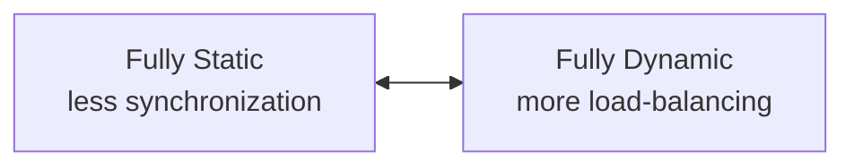

# Uge 11.2 — Concurrency: Parallel Loops

## Metadata

| Felt | Værdi |
|---|---|
| **Lektion** | Uge 11.2 — Concurrency: Parallel Loops |
| **Kursus** | Softwaredesign (SW4SWD-01) |
| **Forelæser** | Jørn Martin Hajek (HAJ) |
| **Kilde** | `Concurrency - Parallel Loops.pdf` (18 slides) |
| **Sprog/kode** | C# |
| **Emner dækket** | lambda-expressions og closures, delightfully parallel loops, håndlavet `MyParallelFor`, static vs. dynamic partitioning, load imbalance, oversubscription, Parallel Extensions (`Parallel.For`, `Parallel.ForEach`, `Parallel.Invoke`), `ParallelLoopResult`, faldgruber ved parallelle loops, parallelle loops i Java/C++/Python |

---

## Agenda

1. Recap af lambda expressions og closures
2. Loops som kilde til parallelisme — "delightfully parallel"
3. En håndlavet parallel loop: `MyParallelFor`
4. Hvorfor den håndlavede løsning er dårlig: trådomkostning og oversubscription
5. Static partitioning og load imbalance
6. Static vs. dynamic partitioning — spektret af tradeoffs
7. Parallel Extensions: `Parallel.For()` og `Parallel.ForEach()`
8. Måleeksempel: distance calculations
9. The danger zones — hvornår mønsteret IKKE passer
10. Tilsvarende konstruktioner i andre sprog

---

## 1. Recap: lambda expressions

Parallel Loop-mønsteret hviler på, at loop-kroppen kan afleveres som en delegate. Derfor starter forelæsningen med at genopfriske lambda expressions.

En lambda kan tildeles en `Func<...>` (returnerer værdi) eller en `Action<...>` (returnerer `void`):

```csharp
Func<int, int> square = x => x * x;

Console.WriteLine(square(5));   // ?
Console.WriteLine(square);      // ?

Action<int> print = i => Console.WriteLine(i);

print(5);
print(10);
```

Pointen med de to `?`-linjer: `square(5)` *kalder* delegaten og udskriver `25`, mens `square` udskriver selve delegate-objektet (dets type), ikke et resultat. En lambda er en værdi, ikke bare syntaks.

En lambda kan også være en helt almindelig kodeblok, der sendes videre som parameter:

```csharp
Func<int> longComputation = () =>
{
    int i;
    for (i = 0; i < 10; i++)
    {
        // Do some work
        Thread.Sleep(1);
    }
    return i;
};
Console.WriteLine(LambdaAsParameters.MeasureTime(longComputation));
```

```csharp
internal class LambdaAsParameters
{
    public static long MeasureTime(Func<int> someFun)
    {
        Stopwatch stopwatch = new Stopwatch();
        stopwatch.Start();
        Console.WriteLine(someFun());
        stopwatch.Stop();
        return stopwatch.ElapsedMilliseconds;
    }
}
```

`MeasureTime` kender intet til arbejdet — den modtager blot en `Func<int>` og måler den. Præcis samme trick bruger `Parallel.For`, der modtager en `Action<int>` som loop-krop.

> Slide 2

### 1.1 Closures — variablen fanges, ikke værdien

```csharp
int stop = 5;
Func<int> longComputation = () =>
{
    int i;
    for (i = 0; i < stop; i++)
    {
        // Do some work
        Thread.Sleep(1);
    }
    return i;
};
Console.WriteLine(LambdaAsParameters.MeasureTime(longComputation));
```

```csharp
int stop = 5;
Func<int> longComputation = () =>
{
    int i;
    for (i = 0; i < stop; i++)
    {
        // Do some work
        Thread.Sleep(1);
    }
    return i;
};
stop = 10;
Console.WriteLine(LambdaAsParameters.MeasureTime(longComputation));
```

Den fremhævede linje `stop = 10;` er hele pointen: lambdaen fanger *variablen* `stop`, ikke dens værdi på definitionstidspunktet. Ændres `stop` inden delegaten kaldes, ser lambdaen den nye værdi og løber 10 iterationer i stedet for 5.

Det er ikke en akademisk detalje. Det er præcis den fælde, der lurer i den håndlavede `MyParallelFor` i afsnit 3, hvor `start` og `end` fanges af hver tråds lambda.

> Slide 3

---

## 2. Loops i applikationer

En betragtelig del af en applikations arbejde foregår i loop-konstruktioner. Ofte er iterationerne uafhængige af hinanden, og når de *faktisk* er uafhængige, kan de udføres parallelt. Bogen *Parallel Programming with Microsoft .NET* (PoPP) kalder det **"delightfully parallel execution"** — den variant af parallelisme, hvor der ikke er noget at koordinere.

Transformationen er syntaktisk næsten triviel:

```csharp
for(int i=0; i<10; i++)
{
  WriteLine("i is " + i)
}
```

bliver til

```csharp
Parallel.For(0, 10, i =>
  {
    Console.WriteLine("i is " + i);
  }
);
```

Kroppen flytter ind i en lambda, og loop-styringen overlades til biblioteket.

> Slide 4

---

## 3. En indledende implementation af parallelle loops

> "just to appreciate the problems of partitioning"
> — Troels Fedder

> Slide 5

Formålet med at bygge sin egen parallelle loop er ikke at bruge den, men at forstå hvilke problemer `Parallel.For` faktisk løser.

### 3.1 Planlægning

Signaturen for den håndlavede parallelle loop:

```csharp
public static void MyParallelFor(
    int inclusiveLowerBound,
    int exclusiveUpperBound,
    Action<int> body);
```

Partitionering til individuelle tråde efter princippet "1 thread per core":

```csharp
int size = exclusiveUpperBound - inclusiveLowerBound;
int numProcs = Environment.ProcessorCount;
int range = size / numProcs;
```

Eksempel: `size = 35`, `numProcs = 4` → `range = 8`. Iterationsrummet deles i fire sammenhængende blokke, én per tråd (Thread 1 … Thread 4). Bemærk at 4 × 8 = 32, ikke 35 — resten skal håndteres, og det gøres ved at lade den sidste tråd tage hele vejen op til `exclusiveUpperBound`.

> Slide 6

### 3.2 Implementationen

```csharp
public static void MyParallelFor(int inclusiveLowerBound, int exclusiveUpperBound,
Action<int> body) {
    // Determine size of each partition of work (size/nCores) – static partitioning
    int size = exclusiveUpperBound - inclusiveLowerBound;
    int numProcs = Environment.ProcessorCount;
    int range = size / numProcs;

     // Initialize threads to do work
    var threads = new List<Thread>(numProcs);
    for (int p = 0; p < numProcs; p++)
    {
        int start = p * range + inclusiveLowerBound;
        int end = (p == numProcs - 1) ? exclusiveUpperBound : start + range;
        threads.Add(new Thread(() => {
            for (int i = start; i < end; i++) body(i);
        }));
    }

    // Start and await threads
    foreach (var thread in threads) thread.Start();   // Start them all
    foreach (var thread in threads) thread.Join();    // wait on all
}
```

Tre ting er værd at holde fast i. `start` og `end` deklareres **inde** i for-løkken — det er nødvendigt, netop på grund af closure-semantikken fra afsnit 1.1; ellers ville alle tråde dele samme variabel og få samme interval. Den sidste tråd (`p == numProcs - 1`) får `exclusiveUpperBound` som `end` og opsamler dermed resten fra heltalsdivisionen. Og til sidst `Join()` på alle tråde, så `MyParallelFor` er blokerende og først returnerer, når hele loopet er kørt færdigt.

> Slide 7

---

## 4. Så er alt godt? — Nej

Omkostningen ved at oprette og nedlægge tråde er massiv: 1 MB stak per tråd og 100.000–200.000 cycles til construction/teardown. En parallel loop, der kaldes ofte, betaler den regning hver eneste gang.

Dertil kommer faren for **oversubscription**:

- `MyParallelFor()` kan selv blive kaldt parallelt → 8 (eller 12, 16, …) tråde på 4 CPU'er.
- OS'et bruger tid på context-switching, hvilket både tager tid og ødelægger cachene.
- Oversubscription-eksemplet på sliden: "yellow is pain!"

Timeline-diagrammet viser seks tråde på færre cores. Hver tråd veksler mellem tilstandene Running (grøn), Ready (gul) og Blocked (rød). Gult — Ready, altså "klar til at køre, men får ikke lov" — dominerer billedet: trådene bruger størstedelen af tiden på at vente på en core i stedet for at regne.

| Tråd | Observation på tidslinjen |
|---|---|
| Thread 1 | Skifter Running → Ready → Running → Ready → Running |
| Thread 2–5 | Korte Running-perioder afbrudt af lange Ready-perioder |
| Thread 6 | Starter Blocked, derefter samme Running/Ready-mønster |

> Slide 8

---

## 5. Static partitioning og load imbalance

Static partitioning fører til **load imbalance**:

- Den u-ækvivalente arbejdsmængde per iteration betyder, at nogle tråde bliver færdige før andre.
- Tråde repræsenterer en statisk partitionering — tråde kan ikke "help each other out". Når en tråd er færdig med sin blok, står den ledig, mens naboen stadig maler.

Profileringen på sliden viser gennemsnitlig CPU-udnyttelse for processen på **44 %**: den starter med 4 aktive logiske cores, falder til 3, så 2, og til sidst 1, efterhånden som trådene bliver færdige én for én. Resten af kapaciteten er spildt.

> Slide 9

### 5.1 Konkret regneeksempel

Antag en parallel loop over `N = [1; 12]`, hvor iteration `i` tager `i` sekunder.

- Samlet arbejde: 1+2+3+…+11+12 = **78 sekunder**.
- Ideel load balance på dual core: 78:2 = **39 sekunder**.

Vores loop bruger static load balancing og deler simpelt i to halvdele:

| Tråd | Iterationer | Tid |
|---|---|---|
| Thread 1 | 1 t.o.m. 6 | 21 sek |
| Thread 2 | 7 t.o.m. 12 | 57 sek |

Samlet tid til at fuldføre loopet: **57 sekunder — 46 % længere end ideelt**.

Sliden viser to fordelinger af iterationerne 1–12 mellem to tråde (orange/blå). Den øverste er den ideelle balancering, hvor de dyre og billige iterationer blandes, så begge tråde får ca. 39 sekunder; den nederste er den naive halvering 1–6 / 7–12. Diagrammerne viser *finish order, not proportional time*.

> Slide 10

---

## 6. Static eller dynamic partitioning

Partitionering er ikke et binært valg, men et spektrum — *Spectrum of Partitioning Tradeoffs* — med **Fully Static** i den ene ende og **Fully Dynamic** i den anden. Bevæger man sig mod static, får man **less synchronization**; bevæger man sig mod dynamic, får man **more load-balancing**.



> Slide 11

Effektiv **static** partitionering kræver *a priori* viden om eksekveringstid, men kræver til gengæld ingen synkronisering. Den er dog less-than-ideal.

Effektiv **dynamic** partitionering kræver ingen forhåndsviden, men kræver synkronisering — ellers træder trådene hinanden over tæerne.

Det er netop den afvejning, .NET's Parallel Extensions kapsler ind, så man slipper for at træffe valget selv.

> Slide 11

---

## 7. Enter Parallel Extensions

I .NET 4 blev klassen `Parallel` introduceret. Den udstiller tre statiske metoder (plus overloads):

```csharp
Parallel.For(start, end, Action)
Parallel.ForEach(collection, Action)
Parallel.Invoke(Action)
```

`Parallel.Invoke` er Parallel Tasks-mønsteret fra forrige forelæsning (se `SW4SWD-01_W11.1_Concurrency_Parallel_Tasks.md`); `For` og `ForEach` er Parallel Loop-mønsteret.

`Parallel.For()` / `ForEach()` giver en række fordele: exception handling, thread-local state, nested parallelism, dynamisk trådantal og sofistikeret load balancing. Kort sagt: *The works!* — alt det, den håndlavede `MyParallelFor` manglede.

> Slide 12

### 7.1 `Parallel.For()`

Parallel udgave af en almindelig for-loop:

```csharp
public static ParallelLoopResult For(
   int fromInclusive, int toExclusive, Action<int> body);
```

Returtypen `ParallelLoopResult` fortæller, om loopet kørte til ende, eller om det blev afbrudt.

Eksempel — sekventielt:

```csharp
for (int i = 0; i < nCalculations; i++)
  C[i] = Math.Sqrt(Math.Pow(A[i], 2.0) + Math.Pow(B[i], 2.0));
```

Oversat til:

```csharp
Parallel.For(0, nCalculations, i =>
   {
     C[i] = Math.Sqrt(Math.Pow(A[i], 2.0) + Math.Pow(B[i], 2.0));
   }
);
```

Iterationerne er uafhængige: hver skriver kun til `C[i]` for sit eget `i` og læser kun `A[i]` og `B[i]`. Ingen delt muterbar tilstand, ingen synkronisering nødvendig.

> Slide 13

### 7.2 `Parallel.ForEach()`

Parallel udgave af iteration over en collection (`foreach`):

```csharp
public static ParallelLoopResult ForEach<TSource>(
 IEnumerable<TSource> source, Action<TSource> body);
```

Eksempel — sekventielt:

```csharp
foreach (var arg in feArgs) {
  arg.C = Math.Sqrt(Math.Pow(arg.A, 2.0) + Math.Pow(arg.B, 2.0));
}
```

Oversat til:

```csharp
Parallel.ForEach(feArgs, arg => {
  arg.C = Math.Sqrt(Math.Pow(arg.A, 2.0) + Math.Pow(arg.B, 2.0));
});
```

> Slide 14

---

## 8. Eksempel: distance calculations

1.000.000 koordinater, hvor afstanden til hinanden beregnes. Samme arbejde kørt tre gange: med almindelig `for(…)`, med `Parallel.For()` og med `Parallel.ForEach()`.

Konsoloutput fra kørslen:

```
Press any key to test with regular for-loop
Regular loop time: 10030 ms
Parallel.For loop time: 4329 ms
Parallel.ForEach loop time: 2730 ms
Finished
Press any key to continue . . .
```

| Variant | Tid | Speedup vs. sekventiel |
|---|---|---|
| Regular `for` | 10030 ms | 1,0× |
| `Parallel.For` | 4329 ms | ca. 2,3× |
| `Parallel.ForEach` | 2730 ms | ca. 3,7× |

Bemærk: speedup er ikke lineær i antallet af cores, og `ForEach` slår her `For` — partitioneringen over en collection rammer bedre end over et indeksinterval i dette tilfælde. Det illustrerer pointen fra afsnit 5–6: hvordan arbejdet partitioneres betyder mere end at det overhovedet paralleliseres.

> Slide 15

---

## 9. The danger zones — når mønsteret IKKE passer

Dette er kernen i, hvad der typisk eksamineres.

### 9.1 Iterationerne *skal* være uafhængige

For at bruge delightfully parallel loops **skal** iterationerne være uafhængige:

```csharp
Parallel.For(2, nCalculations, i =>
   {
     a[i] = a[i-1] + a[i-2]; // Oh God, the pain…the PAIN!!
   }
);
```

Her afhænger iteration `i` af resultatet af `i-1` og `i-2` (en Fibonacci-lignende rekurrens). Loop-carried dependency. Kompilatoren fanger det ikke, koden kompilerer fint — den producerer bare forkerte og ikke-deterministiske resultater. Har man dependencies mellem beregninger, er det Futures-mønsteret, der skal bruges, ikke Parallel Loop (se `SW4SWD-01_W12.1_Concurrency_Dependencies_Futures.md`).

### 9.2 Iterationer er ikke altid `[0..n)`

`Parallel.For` antager et opadgående interval med skridtlængde 1. Almindelige loops gør ikke:

- Downward iterations: `for(..; ..; i--)`
- Stepped iterations: `for(..; ..; I += 2`

Sådanne loops kan ikke oversættes 1:1 og skal omskrives (typisk ved at parallelisere over et normaliseret indeks og udregne det faktiske indeks i kroppen).

### 9.3 Meget små loop-kroppe kan ødelægge parallelisering

Very small loop bodies may defeat parallelisation — der er overhead i delegate invocation og i den synkronisering, load balancing kræver. Er kroppen billigere end at kalde den gennem en delegate, taber man på handlen. Det er samme grundregel som ved Parallel Tasks: arbejdet skal være stort nok til at betale for koordineringen.

> Slide 16

---

## 10. Andre sprog

Parallel Loop er ikke et .NET-fænomen. Samme mønster findes bredt:

**Java**

```java
list.parallelStream().forEach()

IntStream.range(0,10)
        .parallel()
        .forEach(i -> ...);
```

**C++**

- OpenMP
- AMP — Accelerated Massive Parallelism, som bruger GPU'erne på grafikkortet.

**Python**

- `multiprocessing` eller `joblib`

> Slide 17

---

## Opsummering

- Parallel Loop-mønsteret gælder loops, hvor iterationerne er **uafhængige** — PoPP kalder det "delightfully parallel". Transformationen fra `for` til `Parallel.For` er syntaktisk triviel; det svære er at afgøre, om uafhængigheden faktisk holder.
- En håndlavet `MyParallelFor` med én tråd per core demonstrerer problemerne: trådoprettelse koster 1 MB stak og 100.000–200.000 cycles, og bliver loopet selv kaldt parallelt, opstår oversubscription med context-switching og cache-ødelæggelse.
- Static partitioning giver load imbalance, når iterationerne ikke koster det samme. Eksemplet med `N = [1; 12]` viser 57 sek. mod 39 sek. ideelt — 46 % overhead — fordi tråde ikke kan hjælpe hinanden.
- Partitionering er et spektrum: fully static giver mindre synkronisering men kræver forhåndsviden om eksekveringstid; fully dynamic giver bedre load balancing men kræver synkronisering.
- `Parallel.For` / `Parallel.ForEach` fra .NET 4 leverer exception handling, thread-local state, nested parallelism, dynamisk trådantal og sofistikeret load balancing — brug dem frem for håndrullede tråde.
- Faldgruberne: loop-carried dependencies (`a[i] = a[i-1] + a[i-2]`), iterationsrum der ikke er `[0..n)` med step 1, og for små loop-kroppe hvor delegate-overhead og synkronisering æder gevinsten.
