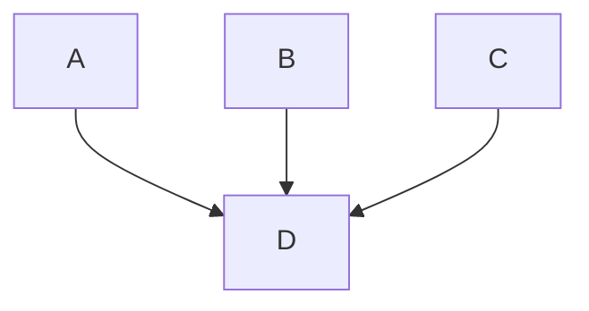
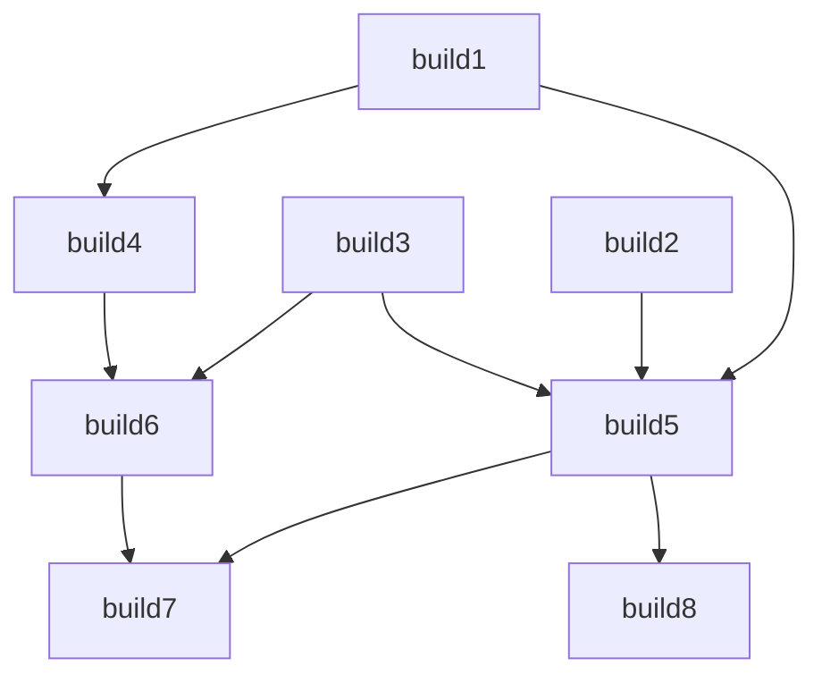
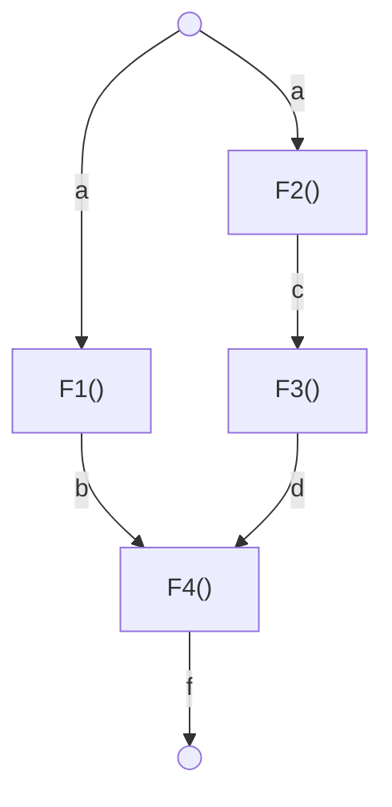

# Uge 12.1 — Concurrency: Dependencies og Futures

## Metadata

| Felt | Værdi |
|---|---|
| **Lektion** | Uge 12.1 — Concurrency: Dependencies og Futures |
| **Kursus** | Softwaredesign (SW4SWD-01) |
| **Forelæser** | Jørn Martin Hajek (HAJ) — titelsliden er krediteret Henrik Bitsch Kirk (18. oktober 2022) |
| **Kilde** | `Concurrency - Dependencies, Futures.pdf` (22 slides) |
| **Sprog/kode** | C# |
| **Emner dækket** | dependencies som forhindring for parallelisme, Directed Acyclic Graph (DAG), continuations (`Task.Factory.ContinueWhenAll`), Futures-mønsteret, `Task<TResult>`, `Task.Run`, `.Result`, data dependencies, iterating in lock step, heat dissipation-eksempel (sekventiel / `Parallel.For` / task barrier), `System.Threading.Barrier`, cache locality |

---

## Agenda

1. Dependencies — hvorfor de er et problem for parallelisme
2. DAG'en som model for afhængigheder
3. Continuations — `ContinueWhenAll`
4. Tiramisu-eksemplet: dependencies er svære at finde
5. Build-eksemplet med continuations
6. Futures — når tasks returnerer resultater
7. Eksempel: F1–F4 og potentiel parallelisme
8. Hvornår er resultatet klar? Tre tilfælde ved `.Result`
9. Iterating in lock step
10. Heat dissipation: sekventiel, parallel, og parallel med task barrier
11. `System.Threading.Barrier`
12. Demo og målinger

---

## 1. Dependencies

Hvor Parallel Loops (se `SW4SWD-01_W11.2_Concurrency_Parallel_Loops.md`) forudsatte, at iterationerne var uafhængige, handler denne forelæsning om det modsatte tilfælde: hvad gør man, når beregningerne *afhænger* af hinanden?

> Slide 2

Hvorfor er dependencies et problem for parallelisme? Fordi en afhængighed er en tvungen rækkefølge: opgave B kan ikke starte, før opgave A har leveret sit resultat. Afhængigheder modelleres som en **Directed Acyclic Graph (DAG)** — en rettet graf uden cykler, hvor en kant fra X til Y betyder, at Y afhænger af X's resultat.

Sliden viser en DAG med otte noder. Node 7 og 8 (nederst, røde) har ingen afhængigheder og kan starte med det samme; node 1 (øverst, grøn) afhænger af flere andre og kan først køre til sidst. Den præcise kantstruktur for netop dette eksempel fremgår entydigt af koden på slide 7 (afsnit 3.2).

Men: *dependencies is a fact of life* — så hvad skal vi gøre? Svaret i denne forelæsning er continuations og futures.

> Slide 3

---

## 2. Dependencies i DAG's — enter continuations

**Continuations** lader dependency-synkroniseringen blive overdraget til TPL (Task Parallel Library). Man specificerer en (mængde af) task(s), der skal være færdig(e), før en ny task starter.



```csharp
var D = Task.Factory.ContinueWhenAll(A, B, C);
```

D starter først, når A, B og C alle er færdige. Man skriver ikke selv `Join()`, `WaitHandle` eller lignende — TPL holder styr på det.

> Slide 4

---

## 3. Tiramisu — dependencies er svære at finde

Opskriften er skrevet som løbende prosa: saml æggeblommer, marsalavin, mascarpone, espresso, kakao, fløde, sukker og ladyfingers; rør sukker i espressoen og sæt den på køl; pisk æggeblommerne; hæld sukker og vin i og pisk kort; kog vand i en gryde; sænk varmen og pisk blandingen over vandbad, til den tykner — osv.

Kilde: `http://www.cookingforengineers.com/recipe/60/The-Classic-Tiramisu-original-recipe`

> Slide 5

### 3.1 "Algoritmyfied"

```csharp
public Tiramisu make_tiramisu(eggs, sugar1, wine, cheese, cream, fingers, espresso, sugar2, cocoa)
{
       dissolve(sugar2, espresso);
           mixture = whisk(eggs);
       beat(mixture, sugar1, wine);
       whisk(mixture); // over steam
       whip(cream);
       beat(cheese);
       beat(mixture, cheese);
       fold(mixture, cream);
       assemble(mixture, fingers);
       sift(mixture, cocoa);
       refrigerate(mixture);
       return mixture; // it's now a tiramisu
}
```

> **What can be done in parallel? Dependencies are hard to find.**

Pointen: koden er skrevet sekventielt, men ikke alle linjer afhænger af hinanden. `dissolve(sugar2, espresso)`, `whip(cream)` og `beat(cheese)` rører ikke `mixture` og kan køre parallelt med resten. Kæden `whisk(eggs)` → `beat(mixture, sugar1, wine)` → `whisk(mixture)` → `beat(mixture, cheese)` → `fold(mixture, cream)` → … er derimod strengt sekventiel, fordi hvert trin muterer `mixture`.

At finde den slags afhængigheder i rigtig kode er arbejdet — ikke at skrive parallel-koden bagefter.

> Slide 6

### 3.2 Continuations i praksis: build-eksemplet

```csharp
var f = Task.Factory;

// Start 3 concurrent, independent builds
var build1 = f.StartNew(() => Build("project1"));
var build2 = f.StartNew(() => Build("project2"));
var build3 = f.StartNew(() => Build("project3"));

// Schedule continuations when dependent jobs are done
var build4 = f.ContinueWhenAll(new[] { build1 }, x => Build("project4"));
var build5 = f.ContinueWhenAll(new[] { build1, build2, build3 }, x => Build("project5"));
var build6 = f.ContinueWhenAll(new[] { build3, build4 }, x => Build("project6"));
var build7 = f.ContinueWhenAll(new[] { build5, build6 }, x => Build("project7"));
var build8 = f.ContinueWhenAll(new[] { build5 }, x => Build("project8"));

// Do work that is independent of builds
Console.WriteLine(System.DateTime.Now + "*** Doing build-independent work... ***");

Task.WaitAll(build1, build2, build3, build4, build5, build6, build7, build8);
```

Afhængighedsgrafen som den fremgår af koden:



> Slide 7

Tre ting at bemærke. `StartNew` starter de tre uafhængige builds med det samme. `ContinueWhenAll` *skemalægger* de afhængige builds — de kører ikke nu, men når deres forudsætninger er færdige. Og mellem skemalægningen og `Task.WaitAll` kan hovedtråden lave build-uafhængigt arbejde; den er ikke blokeret af skemalægningen.

### 3.3 Kørselsresultat

To kørsler af samme program, med tidsstempler:

```
26-04-2016 09:07:06: Building project1
26-04-2016 09:07:06: Building project3
26-04-2016 09:07:06: *** Doing build-independent work... ***
26-04-2016 09:07:06: Building project2
26-04-2016 09:07:07: Building project5
26-04-2016 09:07:07: Building project4
26-04-2016 09:07:08: Building project6
26-04-2016 09:07:08: Building project8
26-04-2016 09:07:09: Building project7
26-04-2016 09:07:10: *** Doing building projects... ***
Press any key to continue . . .
```

```
26-04-2016 09:06:17: Building project1
26-04-2016 09:06:17: *** Doing build-independent work... ***
26-04-2016 09:06:17: Building project3
26-04-2016 09:06:17: Building project2
26-04-2016 09:06:18: Building project4
26-04-2016 09:06:18: Building project5
26-04-2016 09:06:19: Building project6
26-04-2016 09:06:19: Building project8
26-04-2016 09:06:20: Building project7
26-04-2016 09:06:21: *** Doing building projects... ***
Press any key to continue . . .
```

Rækkefølgen mellem uafhængige tasks varierer mellem kørslerne (project1/2/3 kommer i forskellig orden, og det build-uafhængige arbejde falder forskellige steder), men afhængighederne overholdes altid: build4 kommer aldrig før build1, build7 aldrig før build5 og build6. Det er præcis den garanti, TPL leverer.

> Slide 8

---

## 4. Futures — når tasks returnerer resultater

> Slide 9

En **future** er en stand-in for et beregningsresultat, som initielt er ukendt, men bliver tilgængeligt på et senere tidspunkt. Selve beregningen af resultatet kan foregå parallelt med andre beregninger.

- En future er en task, der returnerer en *value* (`Task<TResult>`).

Forskellen på de to task-baserede mønstre:

| Mønster | Svarer til |
|---|---|
| Parallel tasks | *async actions* (ingen returværdi) |
| Futures | *async functions* (returnerer en værdi) |

Futures bruges, når vi vil parallelisere kode med **data dependencies**. Det er kontrasten til Parallel Tasks (`SW4SWD-01_W11.1_Concurrency_Parallel_Tasks.md`), hvor opgaverne netop ikke udveksler data.

> Slide 10

### 4.1 Et eksempel

```csharp
static void Main(string[] args)
{
    var a = "A";
    var b = F1(a);
    var c = F2(a);
    var d = F3(c);
    var f = F4(b, d);
    System.Console.WriteLine(f);
}
```

Læst som kode kører F1, F2, F3, F4 strengt sekventielt. Men datastrømmen fortæller noget andet:



> **Note how output of some functions are input to the next ones — this determines the potential parallelism!**

`F1(a)` og `F2(a)` afhænger begge kun af `a` og kan køre samtidig. `F3(c)` skal vente på F2. `F4(b, d)` skal vente på både F1-grenen og F3-grenen. Grafen — ikke kildekodens linjerækkefølge — bestemmer, hvad der reelt kan paralleliseres.

> Slide 11

### 4.2 Parallelliseret med futures

```csharp
static void Main()
{
    var a = "A";
    Task<string> futureB = Task.Run(() => F1(a));
    var c = F2(a);
    var d = F3(c);
    var f = F4(futureB.Result, d);
    Console.WriteLine(f);
}
```

- Tasken kører den ene gren af træet, mens hovedtråden kører den anden.
- `futureB` er "returværdien" fra `F1()` og forespørges for resultatet i det øjeblik, `F4()` kaldes.

Bemærk hvor lille ændringen er: én linje bliver til `Task.Run(...)`, og ét argument bliver til `futureB.Result`. Resten af koden er uændret. Det er hele pointen med Futures-mønsteret — parallelismen udtrykkes i datastrømmen, ikke i eksplicit trådstyring.

> Slide 12

### 4.3 Hvornår er resultatet klar?

*Futures are pretty darn clever!* På det tidspunkt, hvor vi forespørger `futureB` for resultatet, gælder ét af tre tilfælde:

| Tilstand for tasken, der kører `F1()` | Hvad sker der ved `futureB.Result` |
|---|---|
| Allerede færdig | `futureB.Result` er klar og returneres straks |
| Kører, men er ikke færdig endnu | Den kaldende tråd blokerer, indtil `futureB.Result` er tilgængelig |
| Ikke startet endnu | Tasken eksekveres **inline** i den nuværende trådkontekst, hvis muligt |

Det tredje tilfælde er det, der gør mønsteret billigt: hvis scheduleren aldrig nåede at give tasken en tråd, koster den ikke en context switch — den bliver bare kørt af den tråd, der alligevel stod og ventede.

> Slide 13

---

## 5. Dependencies — iterating in lock step

Et almindeligt algoritmemønster har iterationer `[0..N)`, hvor hver iteration består af mange beregninger, og hvor iteration `i+1` afhænger af beregninger i iteration `i`.

Eksempler:

- Particle simulation
- Heat dissipation
- Conway's Game of Life

I disse tilfælde kan vi **ikke** parallelisere iterationerne (de er afhængige), men vi kan parallelisere beregningerne *inden i* hver iteration.

Vi skal sikre **lock step**: alle (parallelle) beregninger i én iteration skal være færdige, før beregningerne i den næste iteration starter. Uden det lækker halvfærdige data fra iteration `i` ind i iteration `i+1`, og resultatet bliver forkert.

> Slide 14

---

## 6. Heat dissipation-eksemplet

En kvadratisk plade `plateSize × plateSize` simuleres over `timeSteps` tidsskridt. Varmen starter langs den ene side. Hver celle i den nye iteration er gennemsnittet af sine fire naboer i den forrige iteration.

### 6.1 Sekventiel

```csharp
static double[,] SequentialSimulation(int plateSize, int timeSteps)
{
    // Initial plates for previous and current time steps, with
    // heat starting on one side
    var prevIter = new double[plateSize, plateSize];
    var currIter = new double[plateSize, plateSize];

    for (var y = 0; y < plateSize; y++) prevIter[y, 0] = 255.0f;

    // Run simulation
    for (int step = 0; step < timeSteps; step++)
    {
      for (int y = 1; y < plateSize - 1; y++)
      {
        for (int x = 1; x < plateSize - 1; x++)
        {
          currIter[y, x] =
            ((prevIter[y, x - 1] +
            prevIter[y, x + 1] +
            prevIter[y - 1, x] +
            prevIter[y + 1, x]) * 0.25f);
        }
      }
      Swap(ref prevIter, ref currIter);
    }
    return prevIter;
}
```

To plader, `prevIter` og `currIter`, byttes efter hvert tidsskridt med `Swap(ref prevIter, ref currIter)`. Det er double-buffering: der læses kun fra `prevIter` og skrives kun til `currIter`, så ingen celle læser en halvopdateret værdi. Kanterne (`y = 0`, `y = plateSize-1`, `x = 0`, `x = plateSize-1`) opdateres ikke og fungerer som randbetingelser.

> Slide 15

### 6.2 Parallel med `Parallel.For`

```csharp
static double[,] ParallelSimulation(int plateSize, int timeSteps)
{
    // Initial plates for previous and current time steps, with
    // heat starting on one side
    var prevIter = new double[plateSize, plateSize];
    var currIter = new double[plateSize, plateSize];

    for (var y = 0; y < plateSize; y++) prevIter[y, 0] = 255.0f;

    // Run simulation
    for (int step = 0; step < timeSteps; step++)
    {
      Parallel.For(1, plateSize - 1, y =>
      {
        for (int x = 1; x < plateSize - 1; x++)
        {
          currIter[y, x] =
            ((prevIter[y, x - 1] +
            prevIter[y, x + 1] +
            prevIter[y - 1, x] +
            prevIter[y + 1, x]) * 0.25f);
        }
      });
      Swap(ref prevIter, ref currIter);
    }
    return prevIter;
}
```

Kun den indre `y`-løkke er blevet parallel; `step`-løkken forbliver sekventiel, netop fordi iterationerne er afhængige. `Parallel.For` er blokerende og returnerer først, når alle rækker er beregnet — den fungerer altså selv som lock step-barrieren før `Swap`.

> Slide 16

### 6.3 Parallel med task barrier

For at udnytte **cache locality** kan vi sørge for, at de samme tasks altid laver beregninger på den samme sektion af pladen. Pladen deles i lodrette bånd, ét per task (Task 1 … Task 4), og båndinddelingen er den samme i hvert tidsskridt.

Det er den svaghed, `Parallel.For`-varianten har: den re-partitionerer for hvert eneste tidsskridt, så en task har sjældent de samme data i cachen som sidste gang.

> Slide 17

Første forsøg — tasks der selv løber alle tidsskridt igennem, uden nogen synkronisering:

```csharp
// Run simulation
int numTasks = Environment.ProcessorCount;
var tasks = new Task[numTasks];


int chunkSize = (plateSize - 2) / numTasks;
for (int i = 0; i < numTasks; i++)
{
    int yStart = 1 + (chunkSize * i);
    int yEnd = (i == numTasks - 1) ? plateSize - 1 : yStart + chunkSize;
    tasks[i] = Task.Run(() =>
    {
        for (int step = 0; step < timeSteps; step++)
        {
            for (int y = yStart; y < yEnd; y++)
            {
                for (int x = 1; x < plateSize - 1; x++)
                {
                    currIter[y, x] =
                    ((prevIter[y, x - 1] +
                    prevIter[y, x + 1] +
                    prevIter[y - 1, x] +
                    prevIter[y + 1, x]) * 0.25f);
                }
            }

        }
    });
}
```

Bemærk at `step`-løkken nu ligger *inde i* tasken. Dermed løber hver task frit gennem alle tidsskridt, uden at vente på de andre — lock step er brudt, og der er ingen der kalder `Swap`. Sliden markerer det med en "IS IT OVER YET"-illustration; koden er ikke færdig endnu.

> Slide 18

### 6.4 `System.Threading.Barrier`

Vi kan bruge en `System.Threading.Barrier` til at synkronisere tasksene:

```csharp
public Barrier(int signalCount) or
public Barrier(int signalCount, Action<Barrier> postPhaseAction)
```

```csharp
Barrier.SignalAndWait()
```

`signalCount` er antallet af deltagere, der skal nå barrieren, før den åbner. `postPhaseAction` er den handling, der udføres, når alle deltagere er nået frem — én gang, af barrieren selv, før nogen får lov at fortsætte.

> Slide 19

Den færdige version:

```csharp
// Run simulation
int numTasks = Environment.ProcessorCount;
var tasks = new Task[numTasks];

var stepBarrier = new Barrier(numTasks, _ => Swap(ref prevIter, ref currIter));
int chunkSize = (plateSize - 2) / numTasks;
for (int i = 0; i < numTasks; i++)
{
    int yStart = 1 + (chunkSize * i);
    int yEnd = (i == numTasks - 1) ? plateSize - 1 : yStart + chunkSize;
    tasks[i] = Task.Run(() =>
    {
        for (int step = 0; step < timeSteps; step++)
        {
            for (int y = yStart; y < yEnd; y++)
            {
                for (int x = 1; x < plateSize - 1; x++)
                {
                    currIter[y, x] =
                    ((prevIter[y, x - 1] +
                    prevIter[y, x + 1] +
                    prevIter[y - 1, x] +
                    prevIter[y + 1, x]) * 0.25f);
                }
            }
            stepBarrier.SignalAndWait();
        }
    });
}
```

- `new Barrier(numTasks, _ => Swap(...))`: når `numTasks` tasks har nået barrieren, udføres denne action.
- `stepBarrier.SignalAndWait()`: selve barrieren, i bunden af hvert tidsskridt.

`Swap` som `postPhaseAction` er elegansen i løsningen: pladerne byttes præcis én gang per tidsskridt, af barrieren, på et tidspunkt hvor ingen task læser eller skriver dem. Ingen låse, ingen race condition, og tasksene bevarer deres bånd hen over alle tidsskridt.

> Slide 20

---

## 7. Demo — målinger

```
$ ./run
Sequential: 10498
Parallel: 19763
Parallel with a barrier: 6033
```

| Variant | Tid | vs. sekventiel |
|---|---|---|
| Sequential | 10498 | 1,0× |
| Parallel (`Parallel.For` per tidsskridt) | 19763 | **0,53× — næsten dobbelt så langsom** |
| Parallel with a barrier | 6033 | ca. 1,7× hurtigere |

Det centrale resultat: den naive parallelisering med `Parallel.For` er **langsommere end den sekventielle**. Overhead fra at starte og synkronisere et parallelt loop for hvert eneste tidsskridt — plus tabt cache locality, fordi partitioneringen skifter hver gang — mere end æder gevinsten ved at bruge flere cores.

Barrier-varianten opretter derimod tasksene én gang, holder dem på deres eget bånd af pladen gennem hele simulationen, og betaler kun for én letvægts-barriere per tidsskridt. Det er forskellen mellem 19763 og 6033.

Læren er den samme som i Parallel Loops-forelæsningen, blot skarpere: parallelisering er ikke gratis, og *hvor* man placerer synkroniseringen afgør, om man vinder eller taber.

> Slide 21

---

## Opsummering

- Dependencies modelleres som en **DAG**. En kant er en tvungen rækkefølge, og det er grafens struktur — ikke kildekodens linjerækkefølge — der bestemmer den potentielle parallelisme.
- **Continuations** (`Task.Factory.ContinueWhenAll`) overlader dependency-synkroniseringen til TPL: man erklærer hvilke tasks der skal være færdige, og TPL sørger for resten. Hovedtråden er fri til at lave uafhængigt arbejde imens.
- Det svære er ikke at skrive parallelkoden, men at *finde* afhængighederne — tiramisu-eksemplet illustrerer, hvor godt de gemmer sig i sekventielt skrevet kode.
- En **future** er en task der returnerer en værdi (`Task<TResult>`). Parallel tasks ≈ async actions, futures ≈ async functions. Futures bruges til at parallelisere kode med **data dependencies**.
- Ved `.Result` gælder tre tilfælde: færdig (returneres straks), i gang (kaldende tråd blokerer), ikke startet (tasken køres inline i den nuværende trådkontekst, hvis muligt).
- Ved **lock step**-algoritmer (particle simulation, heat dissipation, Game of Life) kan iterationerne ikke paralleliseres, kun beregningerne inden i hver iteration — og alle beregninger i iteration `i` skal være færdige, før `i+1` starter.
- `System.Threading.Barrier` med en `postPhaseAction` giver lock step uden at genskabe tasks per tidsskridt og bevarer cache locality. Målingerne: sekventiel 10498, naiv parallel 19763 (langsommere!), barrier 6033.
