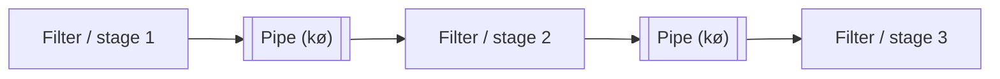
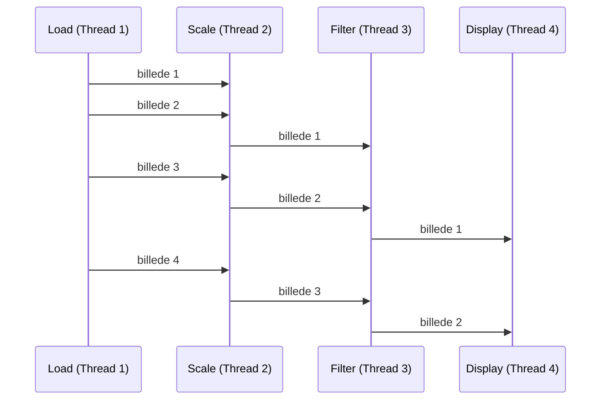
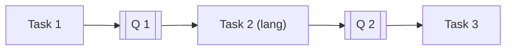
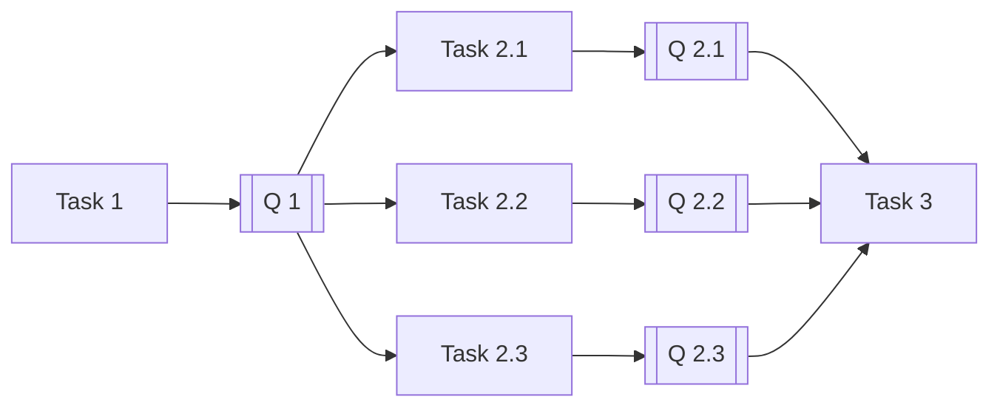

# Uge 12.2 — Concurrency: Pipelines

## Metadata

| Felt | Værdi |
|---|---|
| **Lektion** | Uge 12.2 — Concurrency: Pipelines |
| **Kursus** | Softwaredesign (SW4SWD-01) |
| **Forelæser** | Jørn Martin Hajek (HAJ) |
| **Kilde** | `Concurrency - Pipelines.pdf` (14 slides) |
| **Sprog/kode** | C# |
| **Emner dækket** | Pipeline-mønsteret, filters og pipes, producer-consumer, throughput vs. latency, uneven stage duration og bottlenecks, `BlockingCollection<T>`, `GetConsumingEnumerable()`, `CompleteAdding()`, `TakeFromAny` / `TryTakeFromAny`, detektion af bottlenecks, pipeline cancelation med `CancellationToken`, deadlock |

---

## Agenda

1. Pipeline-mønsteret: filters og pipes
2. Pipelining i praksis — thumbnail-eksemplet og throughput
3. Uneven stage duration — bottlenecks og duplikerede stages
4. Eksempler på pipelines i den virkelige verden
5. Pipeline-mønsteret i C# med `BlockingCollection<T>`
6. Implementation ved uneven stage duration — `TakeFromAny` og `TryTakeFromAny`
7. Detektion af uneven stage duration
8. Pipeline cancelation med `CancellationToken`

---

## 1. Pipelines

> Slide 1

Pipeline-mønsteret **paralleliserer behandlingen af en sekvens af inputværdier**.

En pipeline består af en række **producer/consumer stages (filters)**, forbundet af **køer (pipes)**.

Behandlingen deles op i paralleliserbare stages, hvor:

- Output fra stage `i` er input til stage `i+1`
- Stages er i øvrigt uafhængige



> Slide 2

Bemærk hvordan mønsteret adskiller sig fra de foregående. Parallel Loops (`SW4SWD-01_W11.2_Concurrency_Parallel_Loops.md`) krævede *uafhængige* iterationer. Futures (`SW4SWD-01_W12.1_Concurrency_Dependencies_Futures.md`) håndterede data dependencies mellem forskellige beregninger. Pipeline håndterer det tilfælde, hvor der *er* en streng rækkefølge — hvert element skal igennem stage 1, så 2, så 3 — men hvor forskellige elementer kan befinde sig i forskellige stages samtidig.

---

## 2. Pipelining

Eksempel: fremstilling af thumbnails af billeder i stages.

**Load image > scale image > filter image > display image**

I den sekventielle udgave (4 billeder) kører kun én stage ad gangen. Load for billede 1, så Scale for billede 1, så Filter, så Display — først derefter starter Load for billede 2. Tre af fire stages står stille hele tiden.

I den pipelinede udgave får hver stage sin egen tråd:

| Stage | Tråd |
|---|---|
| Load | Thread 1 |
| Scale | Thread 2 |
| Filter | Thread 3 |
| Display | Thread 4 |

Så snart Load er færdig med billede 1, sender den det videre til Scale og begynder på billede 2. Efter en kort opstartsfase (fill) arbejder alle fire stages samtidig på hvert sit billede. Sliden angiver resultatet som **throughput × 4**.



> Slide 3

Det centrale ved mønsteret: pipelining forbedrer **throughput** (elementer per tidsenhed), ikke **latency** for det enkelte element. Billede 1 er ikke færdigt hurtigere end før — men billede 2, 3 og 4 følger nu tæt efter i stedet for at vente på hele kæden.

---

## 3. Uneven stage duration

Når trinnene har ulige varighed, kan pipelinen **duplikeres (parallelt) for flaskehalsen**.

**Problem: Filter stage bliver bottleneck.** Filter-stagen tager væsentligt længere tid end Load, Scale og Display. Resultatet er, at Load og Scale hurtigt bliver færdige og derefter står ledige, mens Display sulter og kun får arbejde i det tempo, Filter kan levere. Hele pipelinens throughput er begrænset af den langsomste stage.

| Stage | Task | Observation på tidslinjen |
|---|---|---|
| Load | Task 1 | Fire korte blokke i træk, færdig tidligt |
| Scale | Task 2 | Fire korte blokke, færdig kort efter Load |
| Filter | Task 3 | Fire lange blokke — kører længe efter de andre er færdige |
| Display | Task 4 | Fire korte blokke med huller imellem, dikteret af Filter |

**Løsning: flere Filter-stages, der fodrer Display.** Filter-stagen splittes i Filter-1 og Filter-2, som arbejder parallelt på hver sine billeder:

| Stage | Task |
|---|---|
| Load | Task 1 |
| Scale | Task 2 |
| Filter-1 | Task 3 |
| Filter-2 | Task 4 |
| Display | Task 5 |

Med to Filter-tasks halveres flaskehalsens effektive varighed, og Display får jævnt arbejde. Den samlede tid falder markant.

> Slide 4

---

## 4. Eksempler

- **Audio and video processing** — gstreamer framework
- **Visual processing** — autonome robotter
- **"Real-time"/live processing** — stock market data

Fællestrækket: en kontinuert strøm af data, der skal igennem de samme trin, hvor throughput betyder mere end latency for det enkelte element.

> Slide 5

---

## 5. Pipeline-mønsteret i C#

I C# laves pipelines med tasks og concurrent queues (`BlockingCollection<T>`).

```csharp
void DoStage(BlockingCollection<T> input,
             BlockingCollection<T> output)
  try
  {
     foreach (var item in input.GetConsumingEnumerable())
     {
       var result = ...
       output.Add(result);
     }
  }
  finally
  {
    output.CompleteAdding();
  }
}
```

Annotationerne på sliden:

- `input.GetConsumingEnumerable()` — **"Get an iterator for the blocking collection — very important!"**
- `output.Add(result)` — "Generate a result, add it to the output"
- `output.CompleteAdding()` — "When all output addition is done: Signal the completion of adding"

> Slide 6

Hvorfor `GetConsumingEnumerable()` er så vigtig: den blokerer, når køen er tom, og venter på næste element i stedet for at afslutte løkken. Bruger man en almindelig `foreach` over collection'en, itererer man over et øjebliksbillede og går glip af elementer, der tilføjes senere. `GetConsumingEnumerable()` fjerner elementerne, mens den itererer, og terminerer først, når den forudgående stage har kaldt `CompleteAdding()`.

> **What is the purpose of `CompleteAdding()`?**

Svaret er netop dette: `CompleteAdding()` er terminerings-signalet ned gennem pipelinen. Uden det ved den efterfølgende stage aldrig, at der ikke kommer mere data, og dens `GetConsumingEnumerable()` blokerer for evigt. Bemærk at kaldet ligger i `finally` — signalet skal sendes, også hvis stagen fejler undervejs, ellers hænger resten af pipelinen.

---

## 6. Implementation ved uneven stage duration

Når stages er af ulige længde, bruges flere stages (tasks) parallelt. Strukturelt går man fra:



til:



De tre parallelle Task 2-instanser trækker fra samme input-kø `Q 1`, men skriver hver til sin egen output-kø (`Q 2.1`, `Q 2.2`, `Q 2.3`). Task 3 skal derfor læse fra flere køer.

> Slide 7

### 6.1 Konsumenten skal ændres — `TakeFromAny`

**Note that the consumer stage (not the producer stage) has to change.** Producenten (Task 1) er uændret; den lægger stadig i én kø. Det er Task 3, der nu skal håndtere et array af input-køer.

```csharp
private void ToLowerCase(BlockingCollection<string>[] inputs, BlockingCollection<string> output)
{
    var str = "";

    while(!inputs.All(bc=> bc.IsCompleted))
    {
        BlockingCollection<string>.TakeFromAny(inputs, out str);
        str = str.ToLower();
        output.Add(str);
    }
    output.CompleteAdding();
}
```

- `TakeFromAny()` finder en "non-completed", data-bærende collection og henter data fra den.
- **Advarsel på sliden:** "Will crash with an exception if all collections are Complete. How can that happen?"

Svaret er en race condition: `while(!inputs.All(bc => bc.IsCompleted))` evalueres og er sand, men mellem den evaluering og kaldet til `TakeFromAny` kan den sidste producent nå at afslutte sin kø. Så er alle collections completed, når `TakeFromAny` endelig kaldes — og den kaster.

> Slide 8

### 6.2 Nedbruddet

Undtagelsen fra kørslen:

```
Unhandled Exception: System.AggregateException: One or more errors occurred. ---> System.ArgumentException: All collections are marked as complete with regards to additions.
Parameter name: collections
   at System.Collections.Concurrent.BlockingCollection`1.TryTakeFromAnyCoreSlow(BlockingCollection`1[] collections, T& item, Int32 millisecondsTimeout, Boolean isTakeOperation, CancellationToken externalCancellationToken)
   at System.Collections.Concurrent.BlockingCollection`1.TryTakeFromAnyCore(BlockingCollection`1[] collections, T& item, Int32 millisecondsTimeout, Boolean isTakeOperation, CancellationToken externalCancellationToken)
   at System.Collections.Concurrent.BlockingCollection`1.TakeFromAny(BlockingCollection`1[] collections, T& item)
   at StringCompression.PipelinedStringCompressionWithMulitpleCompressors.UpdateCompressionStatsStage(BlockingCollection`1[] inputs, Double& compressionRatio) in ...\PipelinedStringCompressionWithMulitpleCompressors.cs:line 102
   at StringCompression.PipelinedStringCompressionWithMulitpleCompressors.<Run>b__11_5() in ...\PipelinedStringCompressionWithMulitpleCompressors.cs:line 43
   at System.Threading.Tasks.Task.InnerInvoke()
   at System.Threading.Tasks.Task.Execute()
   --- End of inner exception stack trace ---
   at System.Threading.Tasks.Task.WaitAll(Task[] tasks, Int32 millisecondsTimeout, CancellationToken cancellationToken)
   at System.Threading.Tasks.Task.WaitAll(Task[] tasks, Int32 millisecondsTimeout)
   at System.Threading.Tasks.Task.WaitAll(Task[] tasks)
   at StringCompression.PipelinedStringCompressionWithMulitpleCompressors.Run() in ...\PipelinedStringCompressionWithMulitpleCompressors.cs:line 45
   at StringCompression.Program.Main(String[] args) in ...\Program.cs:line 35
```

Kernen: `System.ArgumentException: All collections are marked as complete with regards to additions. Parameter name: collections`. Bemærk også, at den bobler op som en `System.AggregateException` — sådan pakker TPL exceptions fra tasks, og de kommer først frem ved `Task.WaitAll`.

> Slide 9

### 6.3 Løsningen — `TryTakeFromAny`

```csharp
private void ToLowerCase(BlockingCollection<string>[] inputs, BlockingCollection<string> output)
{
    var str = "";

    while(!inputs.All(bc=> bc.IsCompleted))
    {
        if (BlockingCollection<string>.TryTakeFromAny(inputs, out str) != -1)
        {
          str = str.ToLower();
          output.Add(str);
        }
    }
    output.CompleteAdding();
}
```

`TryTakeFromAny` kaster ikke. Den returnerer indekset på den collection, der blev taget fra, eller `-1` hvis det ikke lykkedes. Løkken tjekker derfor `!= -1`, før den behandler `str`. Race conditionen består, men er nu harmløs: i den tabende gennemløb sker der ganske enkelt ingenting, og `while`-betingelsen fanger terminationen i næste runde.

> Slide 10

---

## 7. Detektion af uneven stage duration

Hvordan finder man flaskehalsen?

- **Test og tag tid på filtrene individuelt** — designet er meget let at teste. Hvert filter er en ren funktion fra input-kø til output-kø, uden delt tilstand.
- **Tjek kølængderne under kørsel fra main** for at finde bottleneck(s). Køen *foran* den langsomme stage vokser; køerne efter den er tomme.
- **Erstat de øvrige filtre med dummies**, der blot videresender data, og tag tid på hele forløbet.

Testbarheden er i sig selv et argument for mønsteret: fordi stages kun kommunikerer gennem køer, kan hver stage måles og udskiftes isoleret.

> Slide 11

---

## 8. Pipeline cancelation

Afbrydelse af en pipeline med en `CancellationToken`:

```csharp
private void ToLowerCase(BlockingCollection<string> input, BlockingCollection<string> output,
                                                      CancellationToken token)
{
    try {
        foreach(var item in input.GetConsumingEnumerable())
        {
            if (token.IsCancellationRequested) break;
            var result = ...
            output.Add(result, token);
        }
    } catch (OperationCanceledException) {}
    } finally { output.CompleteAdding() }
}
```

- `output.Add(result)` kan blokere — med en `CancellationToken` kaster den en exception, når cancellation er sat.
- Hvis der ikke afbrydes, **kan programmet deadlocke**.

Det er den vigtige faldgrube. `Add` blokerer, når output-køen er fuld (bounded capacity), og `GetConsumingEnumerable` blokerer, når input-køen er tom. Afbrydes pipelinen midt i, kan en stage stå og vente på plads i en kø, som ingen længere tømmer — klassisk deadlock. Token'en giver den blokerede operation en vej ud: `Add(result, token)` kaster `OperationCanceledException`, som fanges, hvorefter `finally` sikrer, at `CompleteAdding()` alligevel kaldes, så terminerings-signalet forplanter sig ned gennem resten af pipelinen.

> Slide 12

---

## 9. Øvelse

> **Your turn — Solve the String compression exercises**

> Slide 13

---

## Opsummering

- Pipeline-mønsteret paralleliserer behandlingen af en *sekvens* af inputværdier ved at dele arbejdet i producer/consumer stages (**filters**) forbundet af køer (**pipes**). Output fra stage `i` er input til stage `i+1`; stages er i øvrigt uafhængige.
- Gevinsten er **throughput**, ikke latency: efter opstartsfasen arbejder alle stages samtidig på hvert sit element. Thumbnail-eksemplet med fire stages giver throughput × 4.
- **Uneven stage duration** er hovedfaldgruben: den langsomste stage dikterer hele pipelinens throughput. Løsningen er at duplikere flaskehals-stagen (Filter-1, Filter-2, …), så flere tasks fodrer den efterfølgende stage.
- I C# bygges pipelines med tasks og `BlockingCollection<T>`. `GetConsumingEnumerable()` blokerer og venter på data; `CompleteAdding()` er terminerings-signalet og skal kaldes i `finally`, ellers hænger de efterfølgende stages.
- Ved duplikerede stages er det **konsumenten**, ikke producenten, der skal ændres. `TakeFromAny` kaster `ArgumentException`, hvis alle collections er completed — en race condition mellem `IsCompleted`-tjekket og selve kaldet. Brug `TryTakeFromAny`, som returnerer `-1` i stedet for at kaste.
- Flaskehalse findes ved at time filtrene individuelt, overvåge kølængder under kørsel, eller erstatte de øvrige filtre med dummies.
- Cancelation kræver en `CancellationToken` hele vejen igennem: `Add(result, token)` kaster ved cancellation i stedet for at blokere. Uden det kan pipelinen deadlocke, når en stage venter på en kø, ingen længere tømmer.
