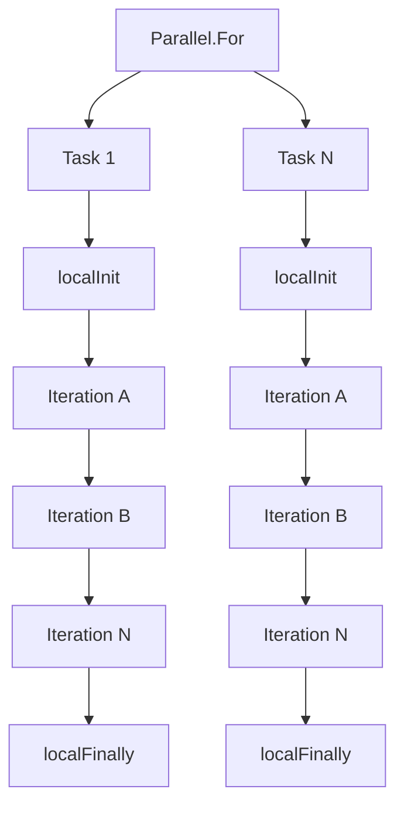
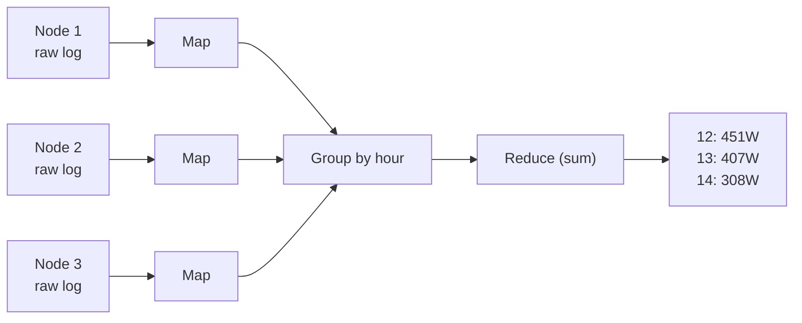

# Uge 13.1 — Concurrency Patterns: Aggregation og MapReduce

## Metadata

| Felt | Værdi |
|---|---|
| **Lektion** | Uge 13.1 — Concurrency Patterns: Aggregation, MapReduce |
| **Kursus** | Softwaredesign (SW4SWD-01) |
| **Forelæser** | Henrik Bitsch Kirk (HK) |
| **Kilde** | `Concurrency - Aggregation, MapReduce.pdf` (27 slides, version 1.0.2) |
| **Sprog/kode** | C# |
| **Emner dækket** | Aggregation, divide-and-combine, dartboard-estimering af pi, `Parallel.For`, lock contention, thread-local aggregering (`localInit`/`localFinally`), `Partitioner`, MapReduce, de fire trin (Distribute, Map, Group, Reduce), PLINQ, C# extension methods, word-count-by-length |

---

## Agenda

1. Aggregation — begrebet og problemet i concurrent kode
2. Aggregation strategies — tre forsøg på parallel pi-estimering
3. MapReduce — mønsteret og de fire trin
4. Eksempel: solpaneler
5. Egen `MapReduce()`-implementering med PLINQ
6. C# extension methods
7. Word-count-by-length-eksemplet

---

## 1. Aggregation

*Aggregation* er handlingen at samle enkeltdele til en samlet mængde. Eksempler uden for concurrency: news aggregators, aggregation-relationen mellem klasser i UML.

I forbindelse med **concurrent programming** er aggregation indsamlingen af **delresultater til ét samlet resultat**. Tænk *divide-and-combine*: opgaven deles ud på flere tråde, hver tråd producerer et delresultat, og delresultaterne kombineres til slut.

Det er præcis kombinationstrinnet der er farligt. Så snart flere tråde skriver til den samme akkumulator, har man en race condition, og den naive løsning — at sætte en lock om hver eneste opdatering — ødelægger den speedup man var ude efter. Resten af decket handler om at flytte kombinationen ud af den varme løkke.

> Slide 3-4

---

## 2. Aggregation strategies — dartboard-estimering af pi

Gennemgående eksempel: approksimér `pi = 3.14159…` med "Dartboard"-algoritmen. Man kaster darts i et kvadrat med side 1.0 og tæller hvor mange der lander inden for kvartcirklen med radius 1.0:

```
π ≅ (4 · n_circle) / n
```

Her er `n_circle` = `nInside` (antal punkter inde i cirklen) og `n` = `_nDarts * _nDarts` (det samlede antal punkter). Matematikken er ikke pointen — aggregeringen er.

> Slide 5-6 (inkl. henvisning til videoen <https://www.youtube.com/watch?v=M34TO71SKGk>)

### 2.1 Sekventiel udgave

```csharp
private static double SerialEstimationOfPi()
{
  double nInside = 0;
  double stepSize = 1/(double)_nDarts; // nDarts – division in x and y
  for (int i = 0; i < _nDarts; i++)
  {
    var x = i * stepSize;
    for (int j = 0; j < _nDarts; j++)
    {
      var y = j * stepSize;
      if (Math.Sqrt(x*x + y*y) < 1.0) ++nInside;
    }
  }

  return 4 * nInside/(_nDarts*_nDarts);
}
```

Aggregeringen er `++nInside` — den ene linje hvor alle delresultater samles. Spørgsmålene fra sliden: hvor er aggregeringen, og kan vi parallelisere beregningen?

> Slide 7

### 2.2 1. forsøg — `Parallel.For` med lock omkring akkumulatoren

Den ydre løkke paralleliseres. Én iteration svarer til én lodret "strip" af darts.

```csharp
private static double ParallelEstimationOfPi()
{
    var locker = new object();

    double nInside = 0;
    double stepSize = 1 / (double)_nDarts;

    // 1 iteration = 1 ”strip” of darts
    Parallel.For(0, _nDarts, i =>
    {
        var x = i * stepSize;
        for (int j = 0; j < _nDarts; j++)
        {
            var y = j*stepSize;
            if (Math.Sqrt(x*x + y*y) < 1.0)
                lock(locker) ++nInside;
        }
    }
    );
    return 4 * nInside / (_nDarts * _nDarts);
}
```

Problemet: `lock(locker)` tages **for hvert enkelt punkt inde i cirklen**. Låsen bliver den centrale flaskehals, alle tråde slås om den, og den parallelle udgave kan ende med at være langsommere end den sekventielle. Sliden illustrerer det med strips farvet efter tråd (Thread 1 rød, Thread 2 grøn, …) og gule markeringer hvor låsen tages.

> Slide 8

### 2.3 Nøgleobservationen

To observationer der åbner for den bedre løsning:

- Parallelle iterationer der kører på **samme** underliggende tråd vil aldrig kæmpe om låsen — de kan per definition ikke køre samtidig.
- Derfor kan iterationer på samme tråd implementeres som var de serielle, og de kan akkumulere i en **thread-local** variabel helt uden synkronisering.

.NET har en `Parallel.For()`-overload der understøtter netop dette:

```csharp
public static ParallelLoopResult For<TLocal>(
    int fromInclusive, int toExclusive,
    Func<TLocal> localInit,
    Func<int, ParallelLoopState, TLocal, TLocal> body,
    Action<TLocal> localFinally);
```

Strukturen er: `Parallel.For` deler arbejdet ud på N tasks. Hver task kører `localInit` én gang, derefter sine iterationer i rækkefølge (hvor delresultatet gives videre fra iteration til iteration), og til sidst `localFinally` én gang.



På dartboard-figuren svarer det til at hver tråd har sin egen tæller (`nInside_T1`, `nInside_T2`, …) der opsamler alle trådens strips, og først til sidst lægges de sammen.

> Slide 9-10

### 2.4 2. forsøg — thread-local aggregering

```csharp
private static double ParallelEstimationOfPi()
{
    var locker = new object();
    double nInsideCircle = 0;
    double stepSize = 1 / (double)_nDarts;
    Parallel.For(0, _nDarts,
        () => 0, // localInit: Initialize nInside (passed to first iteration)
        (i, dummyState, nInside) =>
        {
            var x = i * stepSize;
            for (int j = 0; j < _nDarts; j++)
            {
                var y = j * stepSize;
                if (Math.Sqrt(x * x + y * y) < 1.0) ++nInside;
            }
            return nInside; // Handed over to next task executing on thread
        },

        // localFinally: lock and aggregate local result to global result
        inside => { lock (locker) nInsideCircle += inside; });

    return 4 * nInsideCircle / (_nDarts * _nDarts);
}
```

Delegate-kroppen kræver **ingen** låsning, fordi den kører i samme tråd. Kun `localFinally` — de "afsluttende" operationer — kræver låsning, og den kaldes én gang per task i stedet for én gang per punkt.

Bemærk at kombinationsoperationen her er `+=` på en `double`. Den er associativ og kommutativ (i hvert fald i den idealiserede matematiske forstand), og det er netop derfor mønsteret virker: delresultaterne kan lægges sammen i vilkårlig rækkefølge, og resultatet er det samme uanset hvilken task der bliver færdig først. Et kombinationstrin der ikke havde den egenskab, kunne ikke bruges her — rækkefølgen af tasks er ikke deterministisk.

> Slide 11

### 2.5 3. forsøg — `Parallel.ForEach` med partitioner

Selv med thread-local aggregering er arbejdet i delegaten stadig meget begrænset, og opdelingen af arbejdet er "messy" — man betaler delegate-overhead per strip. Løsningen er en tilsvarende overloadet `Parallel.ForEach()` med en *partitioner*, der skaber "optimale chunks" af arbejde til hver task.

```csharp
private static double ParallelEstimationOfiWithPartitioner()
{
    var locker = new object();

    double nInsideCircle = 0;
    double stepSize = 1 / (double)_nDarts;

    Parallel.ForEach(Partitioner.Create(0, _nDarts), () => 0,
        (range, state, inside) =>
    {
        for (int i = range.Item1; i < range.Item2; i++)
        {
            var x = i * stepSize;
            for (int j = 0; j < _nDarts; j++)
            {
                var y = j*stepSize;
                if (Math.Sqrt(x*x + y*y) < 1.0) ++ inside;
            }
        }
        return inside;
    },
    inside => { lock (locker) nInsideCircle += inside; });

    return 4 * nInsideCircle / (_nDarts * _nDarts);
}
```

`range` er en tuple der indeholder start og slut for netop denne partitions beregninger — derfor `range.Item1` og `range.Item2` i den yderste løkke. Nu behandler hver delegate-invokation et helt interval af strips i stedet for én.

> Slide 12-13

---

## 3. MapReduce

Ofte ønsker man "simple" svar på spørgsmål der kræver undersøgelse af meget store datamængder — rutinemæssigt petabytes (10^15 bytes). Til sammenligning: 1 PB svarer til en 1,5 km høj stak cd-rom'er.

*MapReduce* er et mønster der tillader parallelle beregninger på sådanne datasæt:

> MapReduce takes a set of input key/value pairs, and produces a set of output key/value pairs. The user of the MapReduce library expresses the computation as two functions: Map and Reduce.

Nøglen i strategien er at parallelisere databehandlingen på mange **nodes**, så man opnår speed-up og dermed kan svare på forespørgsler hurtigt.

> Slide 14-15

### 3.1 De fire trin

1. **Distribute** partitionerer og fordeler kildedata til **forskellige nodes**, så der kan arbejdes parallelt.
2. **Map** transformerer kildedatarepræsentationen på hver node til (et stort antal simple) intermediate key-value pairs.
3. **Group** grupperer de intermediate key-value pairs efter nøgle, så de er lette at reducere (en "group-by"-operation).
4. **Reduce** merger/aggregerer/fortolker de reducerede data til et svar på den oprindelige forespørgsel.

*Distribute* og *Group* varierer **ikke** — de leveres typisk af et framework. *Map* og *Reduce* varierer og leveres af udvikleren.


> Slide 16

---

## 4. Eksempel: solpaneler

En solcellepark med mange paneler. Hvert panel skriver en logfil:

```
5/9-14 12:00:00: 75W
5/9-14 12:00:10: 79W
5/9-14 12:00:20: 81W
…
```

Det giver 3.153.600 datapunkter per panel per år.

**Query:** "What is the total per-hour production from all panels?"

**Answer form:**

```
…
From 12:00 to 13:00, 745MW is produced.
From 13:00 to 14:00, 812MW is produced.
…
```

> Slide 17-19

### 4.1 Gennemløbet

Kildedata mappes til intermediate key-value pairs, hvor **key = time** og **value = output**. Derefter grupperes parrene efter nøgle, så de let kan reduceres, og grupperne reduceres — her ved at summere — til ét svar.

På hver node, fx Node 1:

| Kildedata | → Map → | Intermediate |
|---|---|---|
| `5/9-14 12:00:00: 75W` | | `12: 75W` |
| `5/9-14 12:00:10: 70W` | | `12: 70W` |
| `5/9-14 13:00:00: 68W` | | `13: 68W` |
| `5/9-14 13:00:10: 71W` | | `13: 71W` |
| `5/9-14 14:00:00: 58W` | | `14: 58W` |
| `5/9-14 14:00:10: 55W` | | `14: 55W` |

Node 2 giver tilsvarende `12: 73W`, `12: 74W`, `13: 65W`, `13: 62W`, `14: 49W`, `14: 48W`, og Node 3 giver `12: 78W`, `12: 81W`, `13: 69W`, `13: 72W`, `14: 49W`, `14: 49W`.

Efter **Group** på tværs af alle tre nodes:

```
12: 75,70,73,74,78,81
13: 68,71,65,62,69,72
14: 58,55,49,48,49,49
```

Efter **Reduce** (summering):

```
12: 451W
13: 407W
14: 308W
```



> Slide 20

---

## 5. Egen `MapReduce()`-implementering med PLINQ

Hele mønsteret kan udtrykkes som en extension method på `ParallelQuery<T>` — tre LINQ-operationer i træk:

```csharp
// Patterns of Parallel Programming p. 75
public static ParallelQuery<TResult> MapReduce<TSource, TMapped, TKey, TResult>(
   this ParallelQuery<TSource> source,
   Func<TSource, IEnumerable<TMapped>> map,
   Func<TMapped, TKey> keySelector,
   Func<IGrouping<TKey, TMapped>, IEnumerable<TResult>> reduce)
{
  return source
    .SelectMany(map)
    .GroupBy(keySelector)
    .SelectMany(reduce);
}
```

`SelectMany(map)` er Map-trinnet, `GroupBy(keySelector)` er Group-trinnet, og `SelectMany(reduce)` er Reduce-trinnet. Fordi kilden er en `ParallelQuery<TSource>` (PLINQ), udføres kæden parallelt.

Det fremhævede `this ParallelQuery<TSource> source` er det der gør metoden til en extension method.

> Slide 21

---

## 6. C# extension methods

Extension methods er **statiske metoder der kaldes med instans-metode-syntaks**. Nøgleordet er `this` på første parameter.

```csharp
namespace ExtensionMethods
{
    public static class MyExtensions
    {
        public static int WordCount(this String str)
        {
            return str.Split(new char[] { ' ', '.', '?' },
                             StringSplitOptions.RemoveEmptyEntries).Length;
        }
    }
}
```

Brug:

```csharp
using ExtensionMethods;

….
           string s = "Hello Extension Methods";
           int i = s.WordCount();
```

To vigtige detaljer:

- I IL oversætter compileren `WordCount`-kaldet til et almindeligt statisk metodekald. Det er ren syntaktisk sukker.
- Extension methods kan **ikke** tilgå private variabler på typen de udvider.

> Slide 22

---

## 7. Word-count-by-length-eksemplet

Opgaven: tæl hvor mange ord af hver længde der findes i en samling bøger.

### 7.1 De fire trin på data

1. **Distribute**: Læs bøgerne ind i hukommelsen, opdel dem ord for ord.
   ```
   “The fox and the hound are mortal fiends” →
   [“The”, “fox”, “and”, “the”, “hound”, “are”, “mortal”, “fiends”]
   ```

2. **Map**: Map hvert ord til et key-value pair, hvor key = ordets længde.
   ```
   “The”   →   [3: “The”],
   “fox”   →   [3: “fox”],
   “hound” →   [5, “hound”],
   …
   ```

3. **Group**: Lad `GroupBy()` skabe grupper af key-value pairs med samme nøgle.
   ```
   [3: “The”], [3: “fox”], [3: “and”], [3: “the”], [5: “hound”], … →
   [3: [“The”, “fox”, “and”, “the”, “are”]],
   [5: [“hound”]],
   [6: [“mortal”, “fiends”]]
   ```

4. **Reduce**: Reducér antallet af ord i hver gruppering til en tælling.
   ```
   [3: 5],
   [5: 1],
   [6: 2]
   ```

Note fra sliden: dette gælder hvis alt kører på samme node.

> Slide 23, 25, 26

### 7.2 Invokationen

```csharp
static void Main(string[] args)
{
    var files = Directory.EnumerateFiles(@"C:\(…)\Books", "*.txt").AsParallel();

    var wordCounts = files.MapReduce(
        path => Map(path),
        map => ExtractKey(map),
        group => Reduce(group));

    foreach (var pair in wordCounts)
    {
        Console.WriteLine("{0}: {1}",
          pair.Key, pair.Value);
    }
}
```

`Map()` transformerer filer til ord, `ExtractKey()` returnerer nøglen for et ord (dets længde), og `Reduce()` udfører beregninger på de datasæt der hører til samme nøgle. `.AsParallel()` er det der gør sekvensen til en `ParallelQuery` og dermed aktiverer PLINQ.

> Slide 24

### 7.3 `Map()` — kildedata

```csharp
// Map() provides the source data on which the MapReduce query shall run.
static IEnumerable<string> Map(string path)
{
   return File.ReadLines(path) // Read all lines in the path
      .SelectMany(line => line.ToLower().Split(new char[] { ' ', ',', '.', '-', '!', '?', ';' }));
   // Project the words into a single enumerable
}
```

### 7.4 `ExtractKey()` — keySelector

Hvert ords nøgle er dets længde: `“The” → 3`, `“fox” → 3`, `“hound” → 5`, …

```csharp
// ExtractKey() returns the key which the word fits
static int ExtractKey(string word)
{
   return word.Length;
}
```

> Slide 25

### 7.5 `Reduce()` — reduktionen

```csharp
// Reduce() returns a list of key/value pairs representing the results
// Note: IGrouping<> represents a set of values that have the same key
// e.g. [int: [str1, str2, str3, …, strn]]
static IEnumerable<KeyValuePair<int, int>> Reduce(IGrouping<int, string> group)
{
    return new KeyValuePair<int, int>[]
    {
        new KeyValuePair<int, int>(group.Key, group.Count())
    };
}
```

`IGrouping<TKey, TElement>` repræsenterer et sæt af værdier der har samme nøgle. `Reduce()` returnerer en liste af key/value pairs — her kun ét par per gruppe: nøglen og antallet af ord i gruppen.

> Slide 26

---

## 8. Øvelser

Afsluttende slide: "Your turn — Solve the exercises".

> Slide 27

---

## Opsummering

- **Aggregation** i concurrent kode er divide-and-combine: del arbejdet ud, lad hver tråd producere et delresultat, og kombinér delresultaterne til ét samlet svar.
- Den naive parallelisering — en lock omkring akkumulatoren inde i den varme løkke — er korrekt men dræber performance, fordi alle tråde kæmper om den samme lås for hvert eneste datapunkt.
- Løsningen er **thread-local aggregering** via `Parallel.For`-overloaden med `localInit` og `localFinally`: iterationer på samme tråd akkumulerer uden synkronisering, og først i `localFinally` låses der én gang per task.
- Kombinationsoperationen skal kunne anvendes i vilkårlig rækkefølge — summation (`+=`) er associativ og kommutativ, og det er præcis derfor mønsteret er korrekt uanset hvilken task der bliver færdig først.
- En `Partitioner` giver "optimale chunks" og reducerer delegate-overhead yderligere ved at give hver task et helt interval i stedet for én iteration.
- **MapReduce** består af fire trin: Distribute, Map, Group, Reduce. Distribute og Group leveres af frameworket; Map og Reduce skrives af udvikleren.
- I C# kan hele MapReduce-mønsteret skrives som en tre-linjers extension method på `ParallelQuery<T>`: `SelectMany(map).GroupBy(keySelector).SelectMany(reduce)`.
