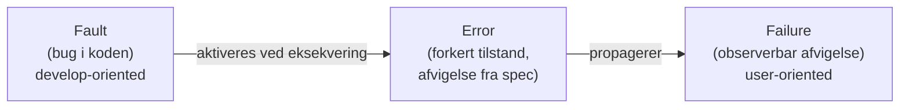
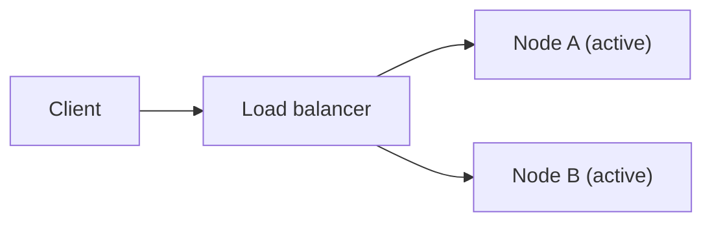
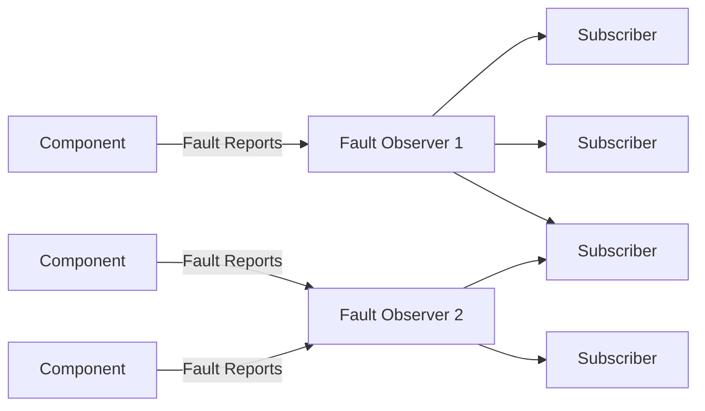
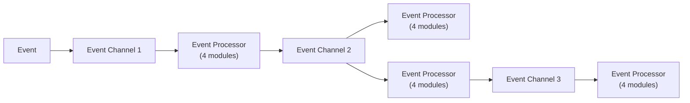
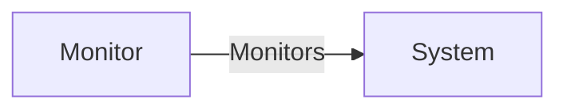
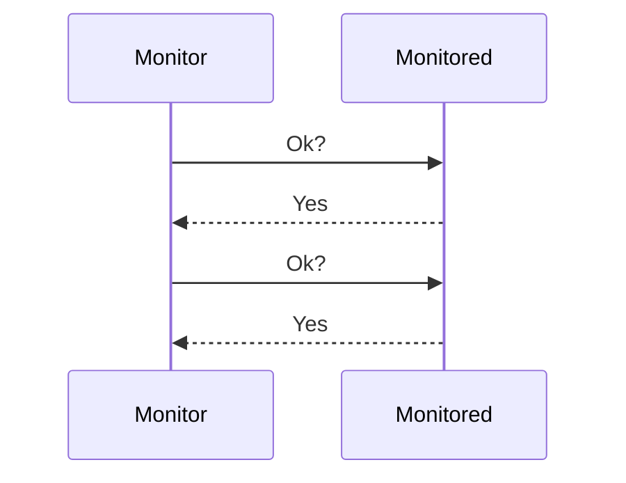
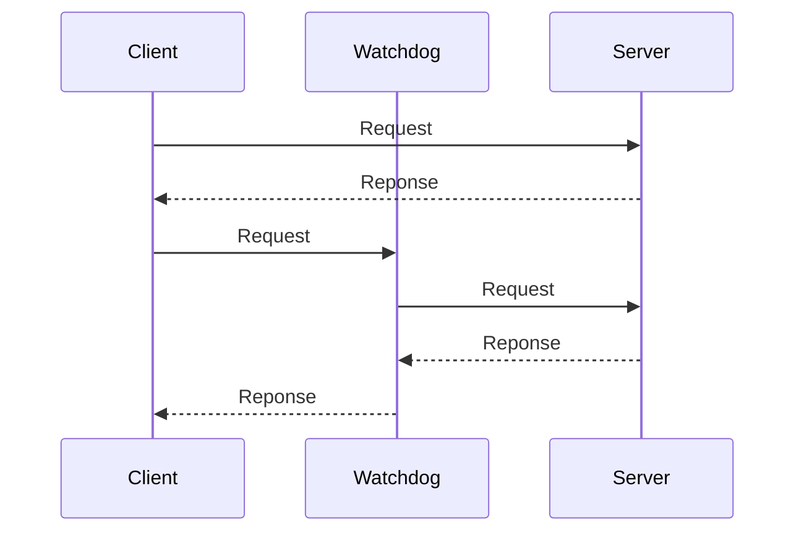

# Uge 13.2 + 14.1 — Error Handling: introduktion, arkitekturmønstre og detection patterns

## Metadata

| Felt | Værdi |
|---|---|
| **Lektion** | Uge 13.2 (fredag) og uge 14.1 (mandag) — Error handling, samlet note |
| **Kursus** | Softwaredesign (SW4SWD-01) |
| **Forelæser** | Henrik Bitsch Kirk (HK) |
| **Kilde** | `Error handling 1.pdf` (21 slides) + `Error handling 2.pdf` (15 slides) |
| **Sprog/kode** | C# |
| **Emner dækket** | Fault/Error/Failure, fail fast vs. recovery, fault tolerance, MTBF/MTTR, defensive programming, error pattern-kategorier, redundancy (spatial/temporal/information), Active/Active, Active/Standby, N+M, mennesker og automatik, Fault Observer, reduced capability, event driven architecture, linting og warnings, detection patterns, System Monitor, Heartbeat, Watchdog, existing metrics, chaos engineering |

---

## Agenda

**Del 1 — Error handling 1: Introduction and architectural patterns**

1. Fault → Error → Failure
2. Fault Tolerance
3. Architectural Patterns
   - Redundancy
   - Software and humans
   - Fault Observer / Correlation
   - Reduced capability

**Del 2 — Error handling 2: Detection patterns**

4. Avoid errors
5. Detection
6. Patterns
   - System monitor
   - Heartbeat
   - Watchdog
   - Existing metrics

---

# Del 1 — Error handling 1

## 1. Hvad er værre end at crashe?

Crash-scenarier, ordnet fra bedst til værst:

1. Application works as expected and never crashes.
2. Application crashes due to rare bugs that nobody notices or cares about.
3. Application crashes due to a commonly encountered bug.
4. Application deadlocks and stops responding due to a common bug.
5. Application crashes long after the original bug.
6. **Application causes data loss and/or corruption.**

Pointen i rækkefølgen: et crash er ikke det værste der kan ske. Det værste er tab eller korruption af data — og næstværst er et crash der sker så langt fra den oprindelige fejl, at man ikke kan finde årsagen.

Der er en naturlig spænding mellem to designstrategier:

- at fejle **øjeblikkeligt** når programmet støder på et problem, altså "fail fast"
- at forsøge at komme sig fra fejltilstanden og fortsætte normalt

Kilde på sliden: <https://blog.codinghorror.com/whats-worse-than-crashing/>

> Del 1, slide 3

---

## 2. Fault, Error, Failure

Tre begreber der ofte blandes sammen, men som beskriver tre forskellige niveauer:

**Fault**
- En defekt (en bug) inde i systemet
- Et *develop-oriented* begreb

**Error**
- Resultatet af at en fault bliver aktiveret
- En afvigelse fra specifikationen
- Kan føre til en failure

**Failure**
- En observerbar afvigelse fra forventet opførsel
- Et *user-oriented* begreb

> Del 1, slide 4

### 2.1 Kæden

1. En fault i koden kan føre til en error når koden eksekveres.
2. En error kan propagere og forårsage en failure.
3. **Ikke alle faults resulterer i errors, og ikke alle errors fører til failures.**



Eksempel fra sliden (Bowling-opgaven):

- **Fault**: Wrong implementation of Bowling calculation of a frame
- **Error**: Incorrect state when the above fault is executed
- **Failure**: System produces a incorrect output visible to the user

> Del 1, slide 5

---

## 3. Fault Tolerance

Målet er at skabe systemer der bliver ved med at fungere trods errors, failures og/eller forstyrrelser.

**Nøglekomponenter:**
- Redundancy
- Recovery mechanism
- Error detection and handling

**Eksempler:** load balancing, checkpointing, software/hardware redundancy.

**Måling:** Mean Time Between Failures (MTBF) og Mean Time to Repair (MTTR). Der er et tradeoff mellem de to — man kan ikke uden videre optimere begge på én gang.

> Del 1, slide 6

---

## 4. Defensive programming-teknikker

Fire udgangspunkter, opstillet som en kæde på sliden:

1. **Fault in all code** — event fault tolerant related software. Antag at der er fejl i al kode, også i den kode der selv skal håndtere fejl.
2. **Memory is not trustable.**
3. **Design**
   - Data structures – self auditing
   - Maintainability
   - Redundancy
4. **Tools**
   - Static analysis – e.g. lint
   - Code standards

> Del 1, slide 7

---

## 5. Error pattern-kategorier

Mønstre til fejlhåndtering falder i fem kategorier:

| Kategori | Formål |
|---|---|
| **Architectural** | Architectural decision for fault tolerance |
| **Detections** | Detecting and locating errors |
| **Error recovery** | Restoring valid state after error occur |
| **Error Mitigation** | Reducing the time between errors |
| **Fault Treatment** | Identifying, isolating and correcting faults in system |

Del 1 handler primært om **Architectural**; Del 2 handler om **Detections**.

> Del 1, slide 8

---

## 6. Redundancy

**Mål:** at øge et systems availability og reliability.

Redundancy står i modsætning til Error Mitigation — redundancy er tidskrævende.

**Overvejelser:**
- Hvilken del skal være redundant?
- Er der problemer ved det? Fx: en webserver — hvad med state, sessions, delt database?

> Del 1, slide 9

### 6.1 Typer af redundancy

**Spatial**
- Systemet kører flere steder / i flere versioner
- Husk at software bør være deterministisk (to identiske kopier af deterministisk software fejler ens på samme input — spatial redundancy hjælper mod hardwarefejl, ikke mod softwarefaults)

**Temporal**
- Genberegning / sammenligning af resultater
- (Mere) tidskrævende

**Information**
- Samme data tilgængelig fra forskellige kilder

> Del 1, slide 10

### 6.2 Konfigurationer

**Active/Active**
- Fast turnover — dobbelt kapacitet
- Kræver en load balancer (LB) foran

**Active/Standby**
- Dobbelt kapacitet
- Én node kan håndtere det hele

**N+M**
- Dyrere

Diagrammerne på sliden viser strukturen:

- *Active/Active*: Client → Load balancer → henholdsvis Node A (*active*) og Node B (*active*), begge med fuldt optrukne pile.
- *Active/Standby*: Client → Load balancer → Node A (*active*) med fuldt optrukket pil, og Node B (*standby*) med stiplet pil.
- *N+M*: Client → Load balancer → Node A.1 (*active*) med fuldt optrukket pil og Node B.1 (*standby*) med stiplet pil; derudover en yderligere Node A.2 (*active*).



> Del 1, slide 11

---

## 7. Software og mennesker

Del 1 indeholder her et helsides billede af kontrolrummet i Tjernobyl — konteksten for de følgende slides om menneskelig fejlbetjening.

> Del 1, slide 12

### 7.1 Mennesker

**Mennesker er dårlige til:**
- Repetitive work
- Many steps
- Reacting fast
- Keep attention

**Mennesker er gode til:**
- Noticing sequences and patterns

Designkonsekvensen: automatisér det repetitive, hurtige og opmærksomhedskrævende; lad mennesket bruges der hvor mønstergenkendelse er værdifuld.

> Del 1, slide 13

### 7.2 Minimér menneskelig indgriben

**Design systemer:**
- så det er synligt at systemet stadig kører normalt — for at undgå menneskelig indgriben når det ikke er nødvendigt
- så errors bliver rettet før de bliver til failures

**Hvordan:**
- Errors rapporteres til noget (fx en fault observer)
- Input- og output-pattern language
  - Tænk DDD's ubiquitous language
- Design systemet til at håndtere faults, errors og failures automatisk
  - Fx ved brug af `Error Handlers` og `Recovery blocks`

> Del 1, slide 14

### 7.3 Maksimér menneskelig deltagelse

Spørgsmålet fra sliden: er et totalt autonomt system overhovedet et mål?

- Giv domæneeksperter eller udviklere mulighed for at hjælpe med at styre systemet
- Prioritér vigtige beskeder før mindre vigtige beskeder
- Kend dine brugere — stil en administrations-/vedligeholdelsesside til rådighed for den pågældende færdighedsgruppe
- Fastlæg procedurer og praksisser på forhånd

De to foregående afsnit er ikke i modstrid: man minimerer den *unødvendige* indgriben og maksimerer kvaliteten af den indgriben der faktisk er brug for.

> Del 1, slide 15

---

## 8. Fault Observer

En **fælles komponent** der hjælper med at rapportere faults og errors — begrundelsen er DRY: fejlrapportering skal ikke duplikeres ud over hele kodebasen.

**Multiple Fault Observers** kan bruges:
- for redundans
- eller per fault-/error-type

**Kommunikation** sker med publisher/subscriber — fx observer-mønsteret, events osv.

Diagrammet på sliden viser komponenter (høje kasser til venstre) der sender *Fault Reports* ind til Fault Observer 1 og Fault Observer 2, som hver videresender til et antal modtagere (mindre kasser til højre). Én af modtagerne får input fra begge fault observers.



> Del 1, slide 16-17

---

## 9. Reduced capability

Failures kan håndteres på to måder:

1. **Redundancy** (tænk Netflix)
2. **Reduced capability**

Reduced capability betyder at systemet fortsætter i en forringet, men brugbar tilstand i stedet for at stoppe helt. Sliden viser Chaos Monkey-projektets README:

> Chaos Monkey randomly terminates virtual machine instances and containers that run inside of your production environment. Exposing engineers to failures more frequently incentivizes them to build resilient services.
>
> Chaos Monkey is an example of a tool that follows the Principles of Chaos Engineering.

Den efterfølgende slide illustrerer princippet med militært flyudstyr: et analogt IP-1310/ALR-radarinstrument ved siden af et moderne cockpit med fulde digitale multifunktionsdisplays. Pointen er at systemet kan falde tilbage til en simplere, mindre kapabel visning frem for at fejle helt.

> Del 1, slide 18-19

---

## 10. Event Driven Architecture

Del 1 afsluttes med et diagram over event driven architecture. Strukturen: et *Event* sendes ind i en **Event Channel**. Der er flere Event Channels (diagrammet viser tre) samlet i en fælles kasse, og omkring dem sidder et antal **Event Processors**, som hver indeholder fire *module*-bokse.

Pilene går begge veje: en Event Processor kan både modtage fra en Event Channel og selv sende videre ind i en anden Event Channel, hvilket giver kæder af behandling. Relevansen for error handling er koblingen — fejl kan rapporteres som events og håndteres af dedikerede processors uden at afsenderen kender modtageren.



> Del 1, slide 20-21

---

# Del 2 — Error handling 2

## 11. Error proofing code — warnings

Del 2 åbner med skærmbilleder fra en IDE, der viser tre typiske advarsler:

- `For-loop can be converted into foreach-loop` på en `for (int i = 0; i < l.Count; i++)`-løkke
- `Possible 'System.NullReferenceException'` på `return l.Count;` hvor `l` kommer fra `GetList()` og kun er null-tjekket inde i et `if (l != null)`-blok
- `Use pattern matching` på en `Equals`-override der bruger `var other = obj as Entity;`

Koden fra `Equals`-eksemplet:

```csharp
public override bool Equals( [CanBeNull] object? obj)
{
    var other = obj as Entity;

    if (ReferenceEquals(/* … */)) return false;
    if (ReferenceEquals(this, other)) return true;
    if (GetType() != other.GetType()) return false;
    if (Id == 0 || other.Id == 0)     return false;

    return Id == other.Id;
}
```

*(En del af den første `ReferenceEquals`-linje er dækket af en tooltip på sliden og kan ikke læses fuldstændigt.)*

> Del 2, slide 3

### 11.1 Linting & warnings

- Warnings kommer fra **compileren**
- Lint er et **separat værktøj** (fx ReSharper)
- Begge hjælper os med at undgå errors
- ~~Try to~~ **Always** treat warnings as errors.

Bemærk at "Try to" er streget over på sliden — pointen skærpes til et ubetinget "always".

> Del 2, slide 4

---

## 12. Detection patterns

Detection er nødvendig for:
- Recovery
- Mitigation

Man leder efter **afvigelser fra normal opførsel**:
- Code checks
- eller brug AI til at lære at bemærke forskelle

> Del 2, slide 5

### 12.1 Detecting

**Afgøre om koden oplever en error:**
- return codes
- exceptions

Det er de to klassiske alternativer. Return codes kræver at kalderen aktivt tjekker returværdien og kan ignoreres i stilhed; exceptions propagerer af sig selv op gennem kaldstakken indtil nogen fanger dem.

**Detektere om eksekveringsenheder er holdt op med at virke:**
- Threads, tasks, processes, nodes

**Threshold detection** — reagér når en målt værdi overskrider en grænse.

> Del 2, slide 6

---

## 13. System Monitor

Et system (eller en del af et system) der er ansvarligt for at overvåge systemet for errors **og handle** på dem.

**Undgå ikke-ideelle situationer:**
- System fails silently
- System fails and notifies everyone

Begge yderpunkter er ubrugelige: den tavse fejl bliver aldrig opdaget, og den der alarmerer alle drukner signalet i støj.

**Overvågning sker ved:**
- Heartbeat — modtagelse af acknowledgements
- Watchdog

**System Monitor bør informere fault observer** — de to mønstre fra Del 1 og Del 2 hænger altså sammen.

Diagrammet viser to bokse: *Monitor* med en pil mærket *Monitors* til *System*.



> Del 2, slide 7

### 13.1 Fordele og overvejelser

**Benefits**
- Early fault detections
- Proactive system maintenance
- Resource allocations

**Considerations**
- Overhead between monitoring and 'normal' usage
- Thresholds
- Privacy and security

> Del 2, slide 8

---

## 14. Heartbeat

Heartbeats sker med **regelmæssige intervaller** — men ikke så mange at de oversvømmer systemet når det i forvejen er under belastning.

**Variationer:**
- Det overvågede system sender en heartbeat til system monitoren
- System monitoren sender en heartbeat-request til det overvågede system og forventer et acknowledgment

> Del 2, slide 9

### 14.1 Flow

En heartbeat kan indeholde **health information**:
- fx fra existing metrics
- eller noget der er specifikt for applikationens logik

Sekvensdiagrammet på sliden viser Monitor og Monitored. Monitor sender `Ok?` til Monitored, som svarer `Yes` (stiplet returpil). Dette gentages med jævne mellemrum.



> Del 2, slide 10

---

## 15. Watchdog

**Problem:** Heartbeat kræver ekstra beskeder — og det samme gælder acknowledgment. På et system under pres er de ekstra beskeder netop det man ikke har råd til.

- Andre måder at kontrollere det overvågede tasks validitet på
- **Passivt** overvåget eksisterende (normal) besked/operation
  - Kræver synlig kommunikation
- Kan gøres med hardware eller software
- En System Monitor overvåger flere tasks — en watchdog kun **én**
  - En watchdog kan rapportere til en System Monitor

> Del 2, slide 11

### 15.1 Heartbeat vs Watchdog

Sliden stiller de to sekvensdiagrammer op ved siden af hinanden.

**Heartbeat** (venstre): Monitor → Monitored med `Ok?`, retur `Yes`. Gentages.

**Watchdog** (højre): Først en normal udveksling uden watchdog — Client → Server med `Request`, retur `Reponse`. Derefter samme udveksling gennem watchdog'en: Client → Watchdog `Request`, Watchdog → Server `Request`, Server → Watchdog `Reponse`, Watchdog → Client `Reponse`.

*(Stavemåden "Reponse" er som på sliden.)*



Forskellen er tydelig: heartbeat genererer trafik der kun findes for overvågningens skyld, mens watchdog'en lytter med på trafik der alligevel skulle sendes.

> Del 2, slide 12

---

## 16. Existing metrics

Systemer under pres bør **ikke** lave ekstra beregninger — det kan forringe servicen yderligere. Undgå også kode der kun eksekveres i særlige scenarier: den er sjældent testet og indeholder derfor sandsynligvis latente fejl.

Brug i stedet **allerede beregnede (eller på anden vis eksisterende) metrics** til at få health information om et kørende system.

Eksempler:
- CPU load
- Memory usage
- Disk usage
- \#Open files
- Response time

> Del 2, slide 13

---

## 17. Chaos Engineering

Injicér med vilje faults i systemet:
- Killing process
- Introduction latency

Det **validerer eksistensen og effektiviteten** af error detection-laget. I stedet for passivt at overvåge systemet får man **aktiv validering** — man venter ikke på at en rigtig fejl skal afsløre om overvågningen virker.

Sliden viser Netflix' Simian Army-logo, som Chaos Monkey er en del af.

> Del 2, slide 14-15

---

## Opsummering

- **Fault → Error → Failure** er kæden: en bug i koden (fault) aktiveres og giver forkert tilstand (error), som kan propagere til noget brugeren kan se (failure). Ikke alle faults bliver til errors, og ikke alle errors bliver til failures.
- Der er en reel spænding mellem **fail fast** og **recovery**. Et crash er ikke det værste udfald — datatab og korruption er værre, og et crash langt fra den oprindelige fejl er næsten umuligt at debugge.
- **Fault tolerance** bygger på redundancy, recovery mechanisms og error detection, og måles med MTBF og MTTR, som der er et tradeoff imellem.
- Redundancy findes som **spatial**, **temporal** og **information**, og udmøntes arkitektonisk i Active/Active, Active/Standby og N+M.
- Systemer bør designes så unødvendig menneskelig indgriben minimeres (synlig normal drift, automatisk fejlhåndtering, en fælles **Fault Observer**), men samtidig så domæneeksperter kan gribe ind meningsfuldt når det er nødvendigt.
- Detection er en forudsætning for både recovery og mitigation, og sker via **return codes**, **exceptions**, overvågning af eksekveringsenheder og threshold detection.
- **System Monitor**, **Heartbeat** og **Watchdog** er de tre detection patterns: monitoren overvåger flere tasks og informerer fault observeren; heartbeat koster ekstra beskeder; watchdog lytter passivt med på eksisterende trafik og overvåger kun ét task.
- Brug **existing metrics** frem for ekstra beregninger på et presset system, og validér detection-laget aktivt med **chaos engineering** frem for at håbe på at det virker.
- Behandl altid **warnings som errors** — compiler-warnings og lint er den billigste form for fejlhåndtering, fordi de fjerner faults før de bliver til errors.
